# 🔧 Making A Ray Tracer - The 'Great' Bug Hunt

> **Date:** 2026-01-27
> **Stage:** 5.5 - Debugging Textures, Materials & More

---

## 🚨 Introduction

This was supposed to be the Episode 6 post per my course's timeline - the grand finale where I'd implement HDR rendering, environment maps, tone mapping, and the remaining features from HW5 and HW6 such as BRDF models, object lights, and full path tracing with importance sampling, next event estimation, multiple importance sampling, and Russian roulette.

Unfortunately, things did not go according to plan.

I took this course as a *Not Included* (non-curricular) technical elective, meaning it does not affect my GPA, so I am fine with receiving a low grade. I was essentially following the course for learning and enjoyment. I wish I could have done more, but after finals ended, the combination of my part-time work (which also required significant effort outside regular hours) and the accumulated ray tracing backlog felt overwhelming. I couldn't bring myself to start on the remaining features.

But I *could* fix bugs. Therefore I tried to squash as many bugs as I could. And this post documents the debugging journey instead - from textures showing solid colors to dielectrics rendering black.

Spoiler: Most bugs were missing default values.

---

## 🐛 Bug #1: The Case of the Missing UVs

**Symptom:** All textured meshes rendered as solid colors. The `landscape-with-a-lake` texture showed pure blue, `landscape-with-a-lake2` showed brown.

| Before | After |
|--------|-------|
| 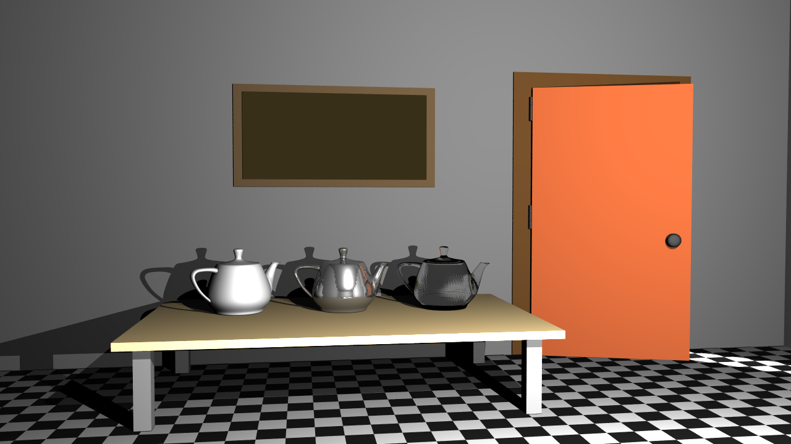 | 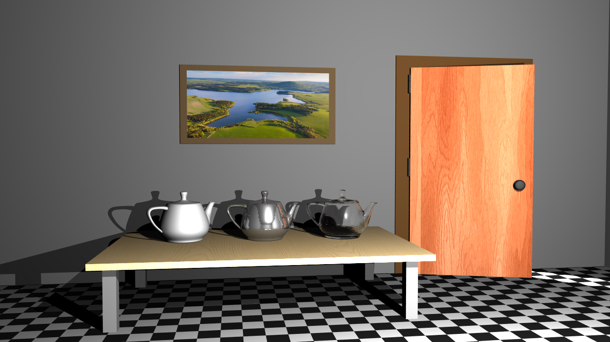 |
| 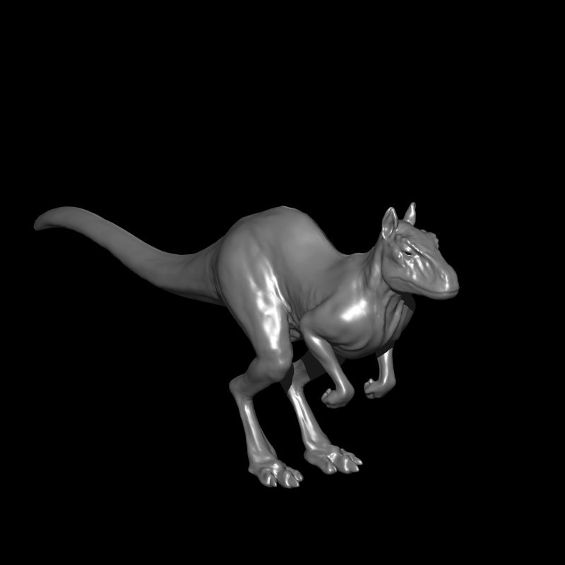 | 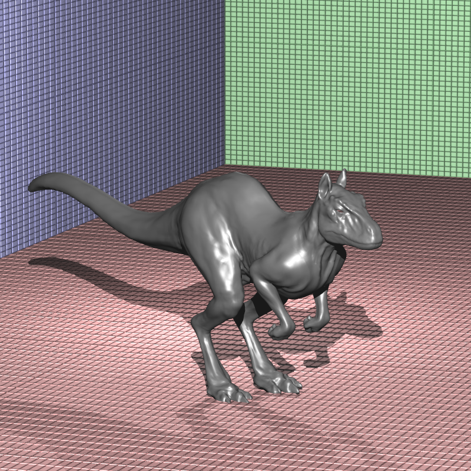 |

**Investigation:** Added debug prints to texture sampling. Every single UV coordinate was `(0, 0)`. The textures were loading fine - the UV mapping was broken.

**Root Cause:** The PLY parser only read vertex positions (`x, y, z`) and normals (`nx, ny, nz`). UV coordinates were completely ignored, even though PLY files contained them:

```
property float x
property float y
property float z
property float nx
property float ny
property float nz
property float u    <- ignored!
property float v    <- ignored!
```

**Fix:** Extended `load_ply()` to detect and parse UV properties. PLY files use various names for UVs, so I added support for all common variants:

```cpp
// Detect UV property names
if (prop.name == "u" || prop.name == "s" || prop.name == "texture_u") u_idx = i;
if (prop.name == "v" || prop.name == "t" || prop.name == "texture_v") v_idx = i;
```

---

## 🐛 Bug #2: Black Dielectrics

**Symptom:** Glass and water materials from HW2/HW3 rendered completely black instead of transparent/reflective.

| Before | After |
|--------|-------|
| 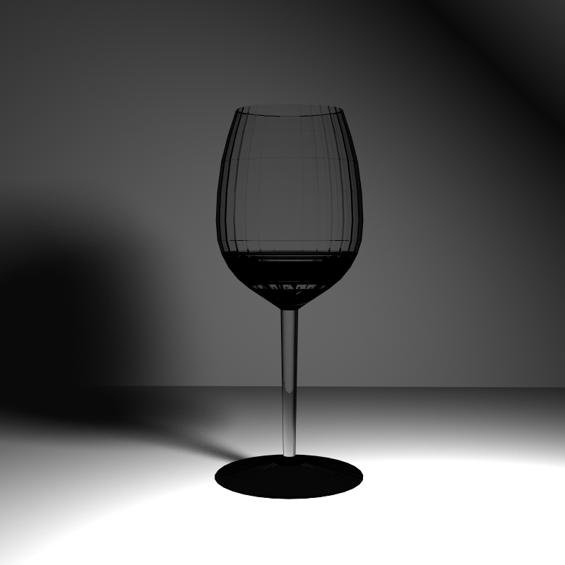 | 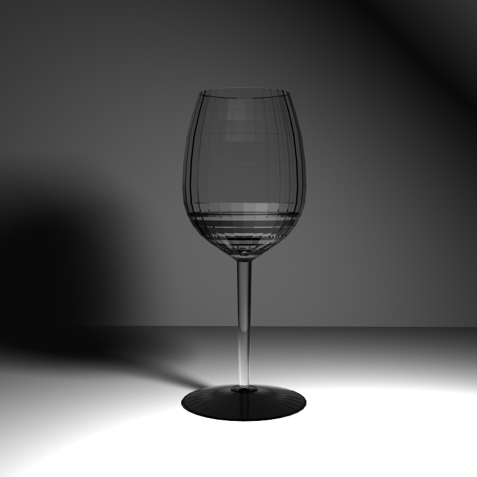 |
| 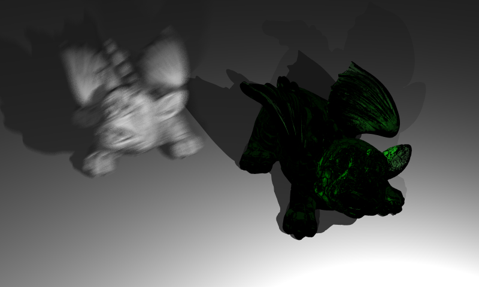 | 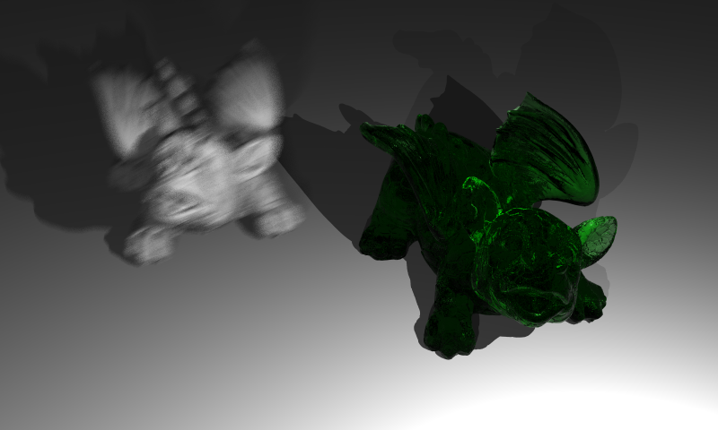 |

**Investigation:** The refraction logic looked correct. Fresnel equations were right. But the final color was always black.

**Root Cause:** The JSON files didn't specify `MirrorReflectance` for dielectric materials - they assumed a default. My default was `(0, 0, 0)`, meaning zero reflection, zero transmission. Everything got multiplied by zero.

**Fix:** One line change - set the default mirror reflectance to white:

```cpp
// Before
material.mirror_refl = Vec3f(0, 0, 0);

// After
material.mirror_refl = Vec3f(1, 1, 1);
```

---

## 🐛 Bug #3: The Invisible Background

**Symptom:** In `galactica_static` and `galactica_dynamic` scenes, the space background texture wasn't showing. Just black void where stars should be.

| Before | After |
|--------|-------|
| 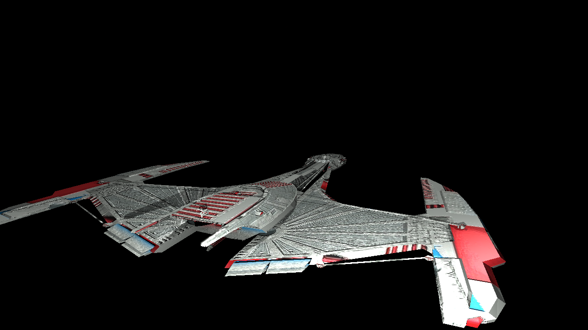 | 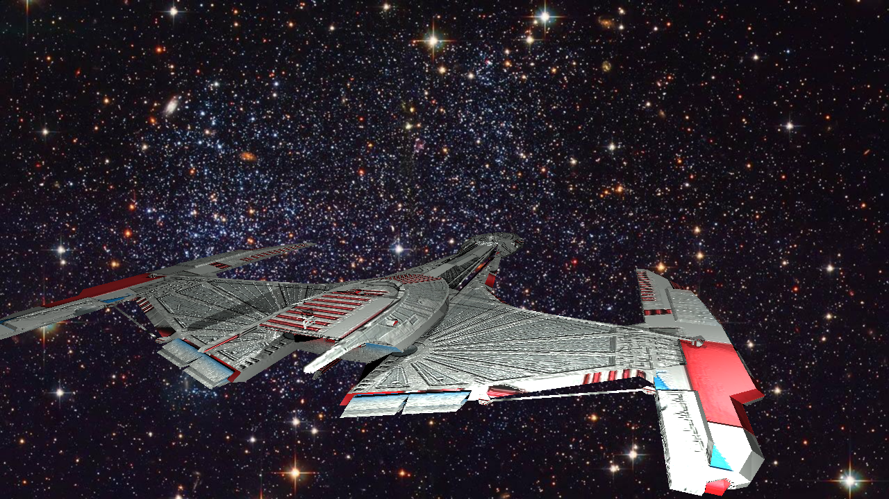 |

**Investigation:** The background texture was loading correctly. The UV calculation for background rays was fine. But the sampled colors were nearly black.

**Root Cause:** Image textures have a `Normalizer` parameter that divides the color values. My default was `255` (standard for LDR images). But the galactica JSONs didn't specify this value, and the background texture expected `1` (no normalization, or HDR-style).

With normalizer=255, a pixel value of `(200, 200, 200)` became `(0.78, 0.78, 0.78)` - way too dark when the texture was already in [0,1] range.

**Fix:** Changed the default normalizer from 255 to 1:

## 🐛 Bug #4: Bump Mapping Gone Wild

**Symptom:** Bump-mapped sphere (Earth) had extremely noisy surface detail - looked like TV static instead of subtle terrain elevation.

| Before | After | Reference |
|--------|-------|-----------|
|  |  | 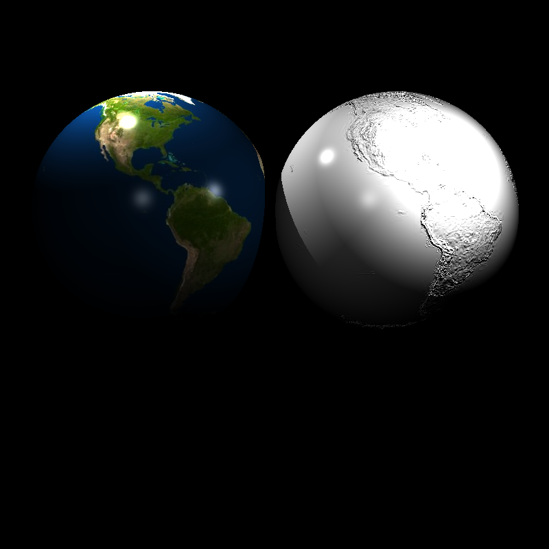 |

**Root Cause:** The bump derivative calculation divided by `du` (pixel step size):

```cpp
float du = 1.0f / width;  // e.g., 1/2048 for a 2K texture
float dh_du = (h_u - h) / du * bumpFactor;  // Multiplies by 2048!
```

For a 2048px texture, this multiplied the bump effect by 2048x. Combined with a `bumpFactor` of 0.01, the actual multiplier was still ~20x too strong.

**Fix:** Keep the mathematically correct derivative formula, but add a clamp to prevent extreme perturbations:

```cpp
float dh_du = (h_u - h) / du * bumpFactor;
float dh_dv = (h_v - h) / dv * bumpFactor;

dh_du = clampF(dh_du, -1.0f, 1.0f);
dh_dv = clampF(dh_dv, -1.0f, 1.0f);
```

---

## 🐛 Bug #5: The Dielectric Circle Artifact

**Symptom:** Glass objects rendered with a strange circular artifact - only a circle in the center was visible, the rest was black.

| Backface cull ON, refl=0 | Cull OFF, refl=0 | Cull OFF, refl=1 | Fixed |
|--------------------------|------------------|------------------|-------|
| 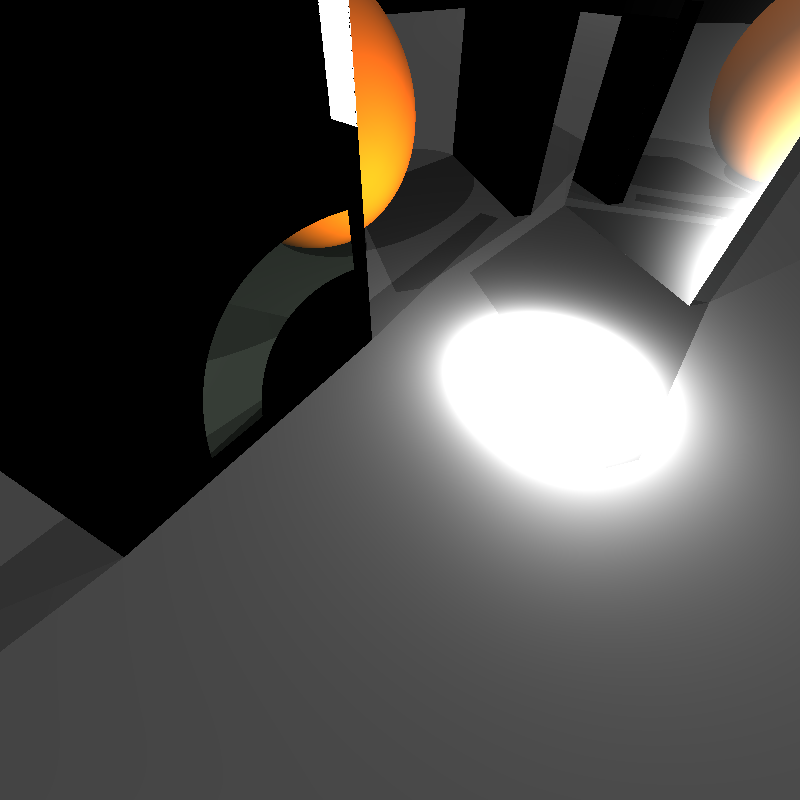 | 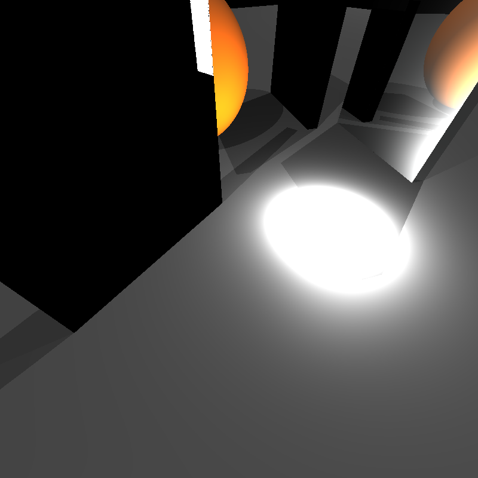 | 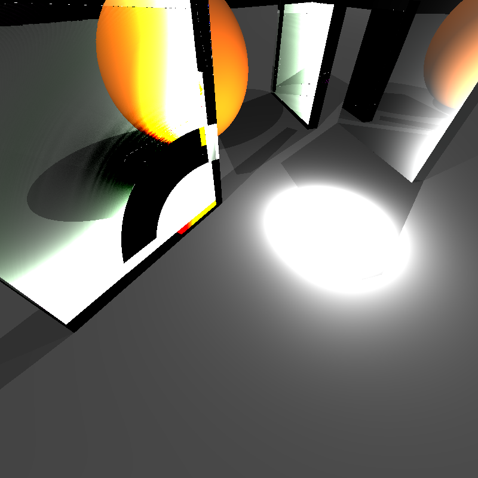 | 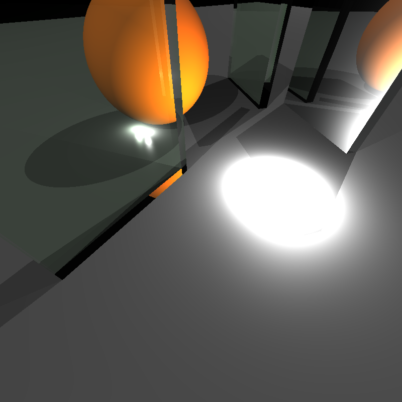 |

**Investigation:** This was a combination of two bugs interacting:
- With backface culling ON + reflectance=0: Circle artifact (image 1)
- With backface culling OFF + reflectance=0: All black (image 2)
- With backface culling OFF + reflectance=1: Noisy mess (image 3)
- With backface and frontface culling properly ON + reflectance=1: Correct!

**Root Cause:** Two issues combined:
1. `MirrorReflectance` default was `(0,0,0)` - everything multiplied by zero
2. Back-face culling didn't account for rays *inside* the medium needing to hit back faces

The ray needs to know if it's inside or outside to cull correctly:
- **Outside → cull back faces** (hit front faces to enter)
- **Inside → cull front faces** (hit back faces to exit)

**Fix:** Two changes:

```cpp
// 1. Default reflectance = 1
mat.mirror_refl = parseVec3f(mj.value("MirrorReflectance", "1 1 1"));

// 2. Conditional face culling based on ray.isInside
if (!ray.isInside && backfaceCullingEnabled) {
    if (ray.direction.dotProduct(tri_face.n_unit) > 0)
        return RAY_MISS_VALUE;  // Cull backface
}
if (ray.isInside) {
    if (ray.direction.dotProduct(tri_face.n_unit) < 0)
        return RAY_MISS_VALUE;  // Cull frontface
}
```

---

## 🐛 Bug #6: Noise in Mirror Scenes

**Symptom:** `mirror_room` scene had random noise/fireflies even with a single sample per pixel.

| Before | After |
|--------|-------|
| 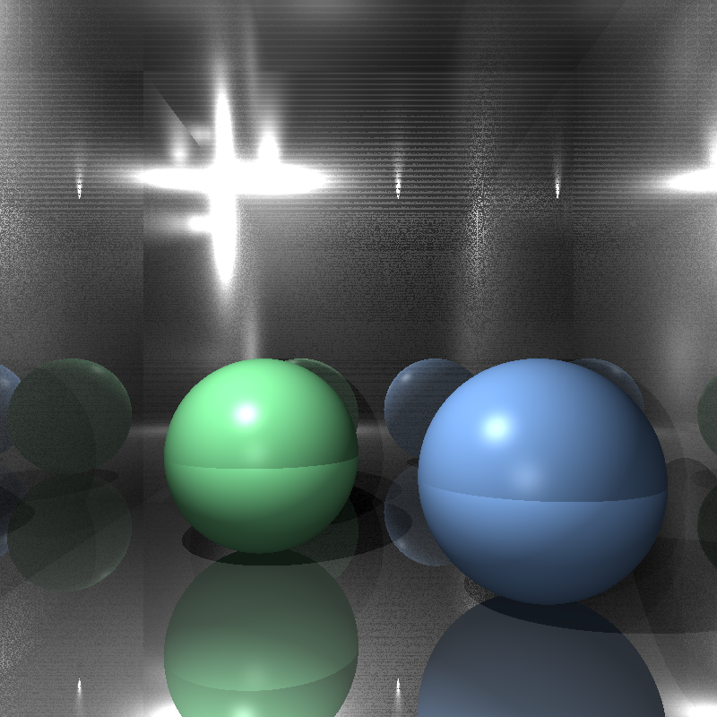 | 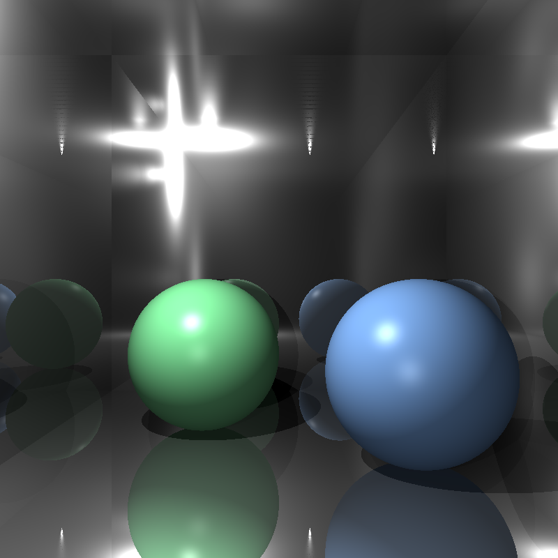 |

**Root Cause:** Two issues:

1. **Jitter with single sample** - Even when `num_samples == 1`, the code was applying random jitter to pixel coordinates. This caused inconsistent sampling.

2. **Shadow ray self-intersection** - The shadow ray `minT` was set to exactly `distToLight`, but floating-point precision meant the light could sometimes occlude itself.

**Fix:**

```cpp
// Fix 1: Center sample when only 1 sample
if (num_samples == 1) {
    jitter_x = 0.5f;
    jitter_y = 0.5f;
}

// Fix 2: Add epsilon to shadow ray distance
float minT = distToLight + eps_shadow;
```

---

## 🎓 Lessons Learned

1. **Default values matter** - Three bugs were wrong defaults (mirror_refl, normalizer, jitter). Always think about what happens when a parameter is missing.

2. **Debug prints are your friend** - Adding UV output immediately revealed all coordinates were (0,0).

3. **Read the file format spec** - PLY files can have many property names for the same concept.

4. **Clamp your derivatives** - Mathematically correct doesn't mean visually correct.

5. **Epsilon everywhere** - Floating-point precision issues cause shadow acne, self-intersection, and noise. When in doubt, add epsilon.

---

## 🔜 What's Next

The remaining features from HW5 and HW6 are still on the list, and I plan to implement them gradually in my own time:

- BRDF models (Phong, Blinn-Phong, Torrance-Sparrow)  
- Object lights (mesh & sphere lights)  
- Full path tracing  
- Importance sampling  
- Next Event Estimation  
- Multiple Importance Sampling  
- Russian Roulette  
- Environment maps  
- HDR rendering  
- Tone mapping  
- Spot light fixes  
- Many additional bugs I will inevitably encounter later  

I also want to take a moment to thank **CENG795 course coordinator Oğuz Hoca** for allowing deadline extensions when needed and for the generous grading in earlier assignments. Even though I took the course as *Not Included*, I learned a great deal from it and truly enjoyed working on this ray tracer.

I will continue improving the renderer at my own pace. Hopefully, one day I will write Episode 6 as well - the post where all those remaining features finally come together.


Take care, and thank you all.

---
