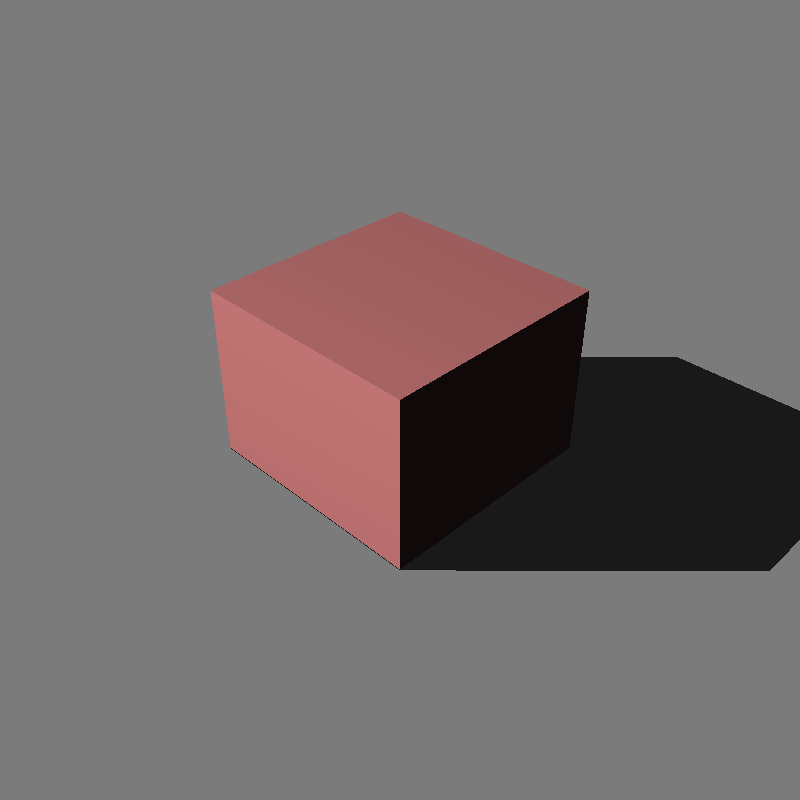
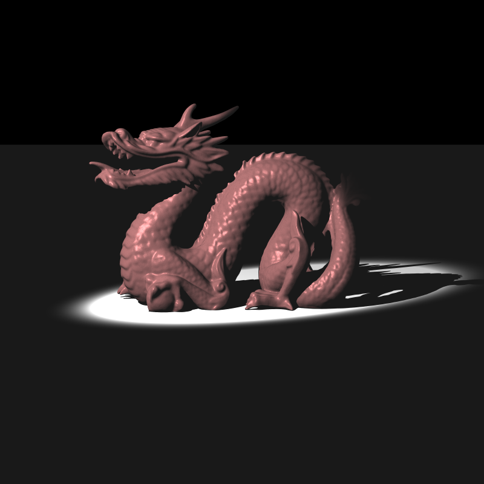
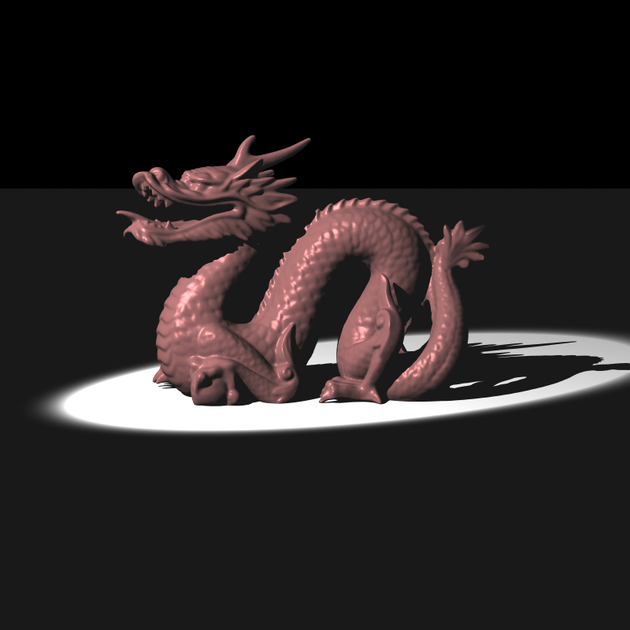

# 🌟 Making A Ray Tracer - Advanced Lighting (Kinda)

> **Date:** 2026-01-08  
> **Stage:** 5 - Advanced Lighting & HDR Rendering (Partial)

---

## 🚨 Introduction

Finals week hit hard. The assignment spec called for directional lights, spot lights, environment maps, HDR rendering, and tone mapping.

I got two of those working. Sort of.

## 🎯 Assignment Scorecard

- ✅ Directional lights 
- ⚠️ Spot lights (buggy)
- ❌ Environment lights (HDR spherical maps)
- ❌ HDR pipeline (.exr/.hdr files)
- ❌ Tone mapping (Photographic, Filmic, ACES)

Two out of five isn't great, but at least directional lights are solid.

## 💡 Directional Lights

The simple one - infinite distance light sources like the sun. All rays parallel, no distance falloff.

Key characteristics:
- Direction vector only (no position)
- Uses radiance instead of intensity
- Shadow rays test to infinity
- No `1/d²` attenuation



There's a black line on the bottom left edge - probably self-intersection despite epsilon offsets. Tried adjusting the values but no luck. Added to the debug list.

## 🔦 Spot Lights - The Broken One

Spotlights emit in a cone with smooth falloff from center to edge. Like a flashlight or stage light.

### The Setup

Required parameters:
- Position and direction
- Coverage angle (outer boundary)
- Falloff angle (inner full-intensity zone)
- Intensity (with distance attenuation)

The attenuation formula:

$$s = \left(\frac{\cos(\alpha) - \cos(\text{coverage}/2)}{\cos(\text{falloff}/2) - \cos(\text{coverage}/2)}\right)^4$$

### The Bug

My spotlight is smaller than it should be:

| My Output | Expected Output |
|-----------|-----------------|
|  |  |

The gradient looks right, but the coverage is wrong. Implementation:
```cpp
// Spot lights
for (const auto& spot : scene.spot_lights)
{
    Vec3f lightToPoint = x - spot.position;
    float distance = lightToPoint.length();
    if (distance < 1e-6f) continue;

    Vec3f L = lightToPoint / distance;

    float cosAlpha = clampF(spot.direction.dotProduct(L), -1.0f, 1.0f);
    float alpha = std::acos(cosAlpha);

    float coverage_rad = spot.coverage_angle * (float)M_PI / 180.0f;
    float falloff_rad = spot.falloff_angle * (float)M_PI / 180.0f;
    float coverage_half = coverage_rad * 0.5f;
    float falloff_half = falloff_rad * 0.5f;

    float s = 0.0f;
    if (alpha <= falloff_half) {
        s = 1.0f;
    } else if (alpha <= coverage_half) {
        float denom = std::cos(falloff_half) - std::cos(coverage_half);
        if (std::fabs(denom) < 1e-6f) {
            s = 0.0f;
        } else {
            float val = (std::cos(alpha) - std::cos(coverage_half)) / denom;
            val = std::max(0.0f, val);
            s = std::pow(val, 4);
        }
    } else {
        s = 0.0f;
    }

    if (alpha > coverage_half || s < 1e-6f) continue;

    PointLight tempPL;
    tempPL.position = spot.position;
    tempPL.intensity = spot.intensity * s;

    if (!InShadow(x, tempPL, n_shading, eps_shift, scene, ray.time)) {
        color = color + ComputeDiffuseAndSpecular(ray.origin, mat, tempPL, x, n_shading, w0);
    }
}
```

Something's off in the angle calculation or cone interpretation. Couldn't track it down before deadline.

## 🚧 The Cool Stuff I Didn't Get To

Environment lighting would've been the highlight here. You wrap the entire scene in an HDR image - like a 360° photo - and use it as the light source. The PDF shows the same car model rendered in different HDR environments; the mood changes completely based on the lighting. That's the kind of result I wanted.

Tone mapping compresses HDR values into displayable ranges without losing detail. The difference between clipped highlights and properly tone-mapped images is huge in production rendering.

The output examples in the homework PDF look genuinely impressive. I want to implement these features and see my ray tracer produce that quality level.

## ✅ What's Next

This homework is incomplete, I know. But as I said I will do a refactor and hunt the bugs from this homework as well as the previous ones. I will have a break to do so after my last final in a few days.

Just need to survive finals first.

---