# 🌌 Making A Ray Tracer - Gotta Go Fast

> **Date:** 2025-11-19   
> **Stage:** 2 - Acceleration Structures, Transformations, Instancing

---
## 🚀 Introduction

*Welcome back, dear readers.*

In the previous episode, I built a functional ray tracer that could render scenes with reflections, refractions, and smooth shading. It worked... but it was slow. Painfully slow for complex scenes. Remember that lobster image that took 38 minutes at 256x256? Or the gold dragon that needed over 2 hours?

This homework made my ray tracer actually viable by fixing that long render times.

Spoiler alert: that 38-minute lobster? It now renders in seconds.

## 🎯 Goals for This Stage

- Acceleration structures: BVH (Bounding Volume Hierarchy) implementation
- Geometric transformations: translation, rotation, scaling, composite matrices
- Instancing: reusing meshes with different materials and transforms

## 🔺 Bounding Volume Hierarchy (BVH)

The naive approach to ray tracing has a brutal performance characteristic: for every ray, you test intersection against every single object in the scene. With thousands or millions of triangles, this O(N) complexity makes rendering impractical.

Enter **Bounding Volume Hierarchy**.

The core idea is simple but powerful: wrap groups of objects in axis-aligned bounding boxes (AABBs), organize them into a binary tree, and only test rays against objects whose bounding boxes they actually hit. Instead of checking every triangle, we traverse the tree-cutting the complexity down to O(log N).


*BVH bounding boxes visualized on a sample scene. Each colored box represents a node in the hierarchy.*

### My Implementation

I implemented a **two-level BVH structure**:

1. **Top-level BVH**: Contains all primitives in the scene (triangles, spheres, meshes)
2. **Per-mesh BVH**: Each mesh has its own internal BVH for its triangles

When a ray traverses the scene, it first goes through the top-level BVH. If it hits a leaf node containing a mesh, it then traverses that mesh's internal BVH. This two-level approach works well because meshes are often spatially coherent, and having separate BVHs for them improves cache locality.

For partitioning primitives into the tree, I used **median split** rather than **Surface Area Heuristic (SAH)**. Median split is simpler to implement-just sort primitives along an axis and split at the median. SAH produces better trees by minimizing expected ray intersection cost, but it's more complex. For now, median split gives good enough results. I might implement SAH later if I need to squeeze out more performance.

### The Results

As expected, the speedup was dramatic. Here are the before/after render times for images:

| Image | Without BVH | With BVH | Speedup |
|-------|-------------|----------|---------|
| Cornell Box Recursive | 0.173s | 0.175s | ~1x |
| Spheres Mirror | 0.147s | 0.157s | ~1x |
| Science Tree Glass | 13.251s | 0.741s | **18x** |
| Raven | 11.722s | 0.371s | **32x** |
| Tower Smooth | 13.251s | 0.732s | **18x** |
| Bunny with Plane | 16.713s | 0.260s | **64x** |
| Windmill Smooth | 16.001s | 0.947s | **17x** |
| Mountain Smooth | 22.948s | 0.404s | **57x** |
| Berserker Smooth | 5.600s | 0.681s | **8x** |
| METU Teapots | 2m 21s | 0.479s | **296x** |
| Ton Roosendaal | 5m 53s | 0.533s | **664x** |
| David | 6m 53s | 0.681s | **607x** |
| Trex (256x256) | 24m 29s | 2.518s * | **583x** |
| Lobster (256x256) | **38m 25s** | **2.665s** * | **865x** |
| Chinese Dragon (White) | 45m 31s | 3.622s | **754x** |
| Other Dragon (Gold) | 141m 7s | 1.726s | **4,905x** |

\* I used 1024x1024 version instead of 256x256. So speed up is ~16x times more actually.

The simple scenes (Cornell box, spheres) don't benefit much because they have very few objects. But for mesh-heavy scenes? The difference is night and day. The lobster went from 38 minutes to under 3 seconds-an **865x speedup**. The gold dragon that took over 2 hours? Now renders in 11 seconds.

This is the difference between "technically works" and "actually usable."

### Bug Fixes From Stage 1

- Appearantly rabbit_with_plane.json didnt specify a MaxRecursionDepth so it was set to 0. Now my code sets it to 6 if not specified.

| Old Bunny | New Bunny |
|-------------------|----------------|
| .png) | 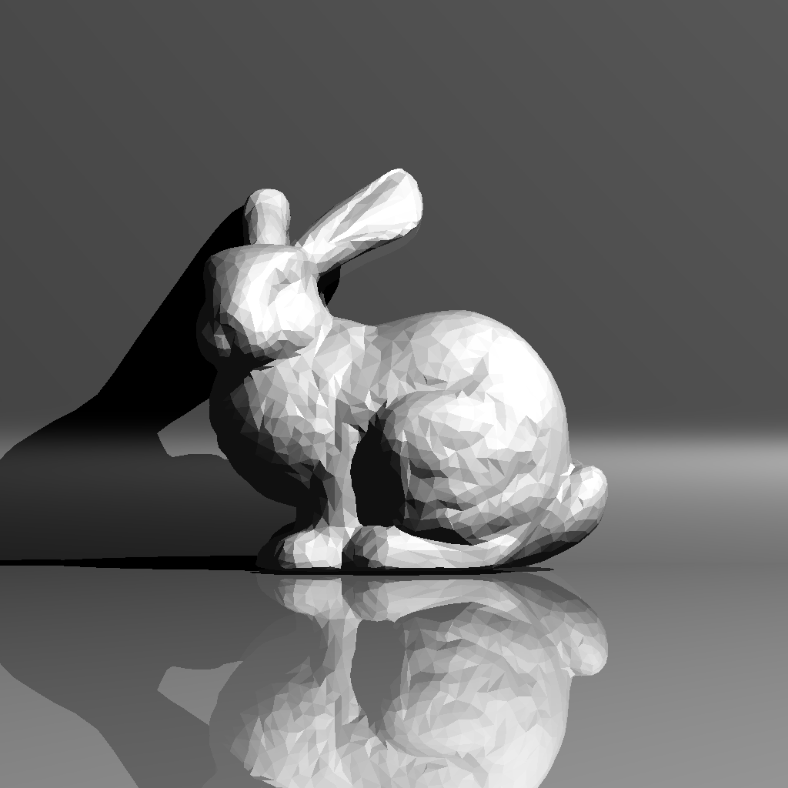 |

- I played around with shadow ray epsilon for White Dragon. I found that at 1e0 the acnes disappead. I know this value is weird, but it might be right because the dragon is small.

| Old Dragon | New Dragon |
|-------------------|----------------|
| .png) |  |

- Lastly here's the the lobster and trex in all its glory (I think trex's acnes are gone because json's shadow ray epsilon was set to work for spesifiaclly 1024x1024):

| Lobster (1024x1024) | Trex (1024x1024) |
|-------------------|----------------|
| 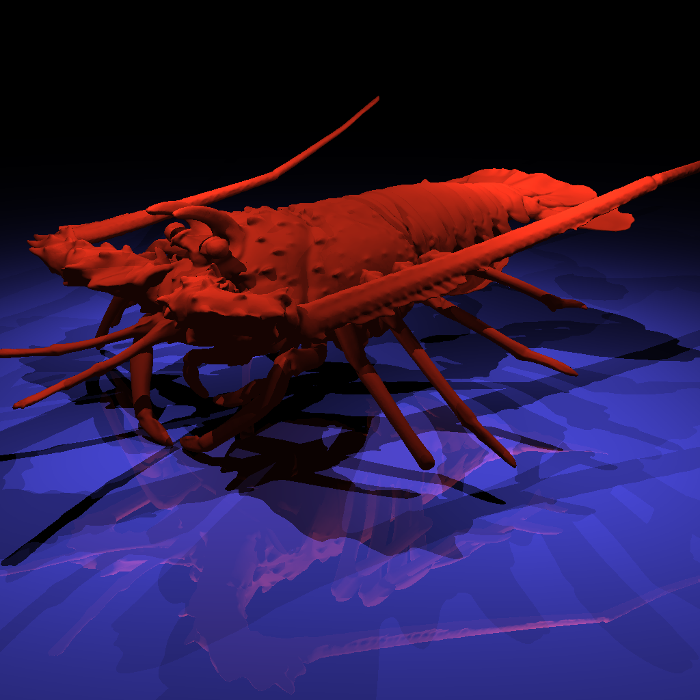 | 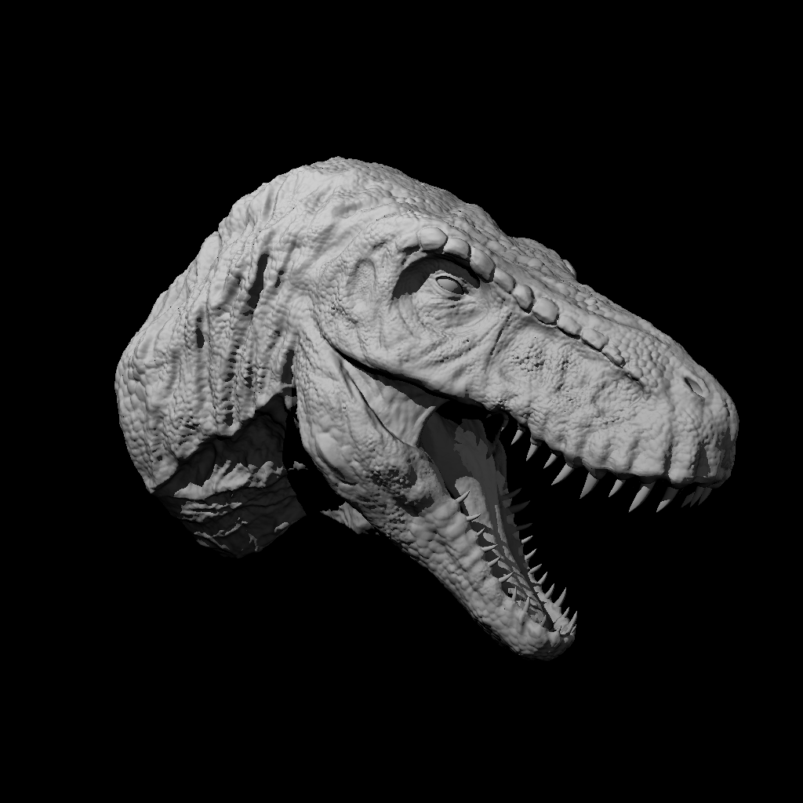 |

## 🔄 Geometric Transformations

The second major addition in this assignment was support for geometric transformations. Previously, objects could only exist at their original positions and orientations defined in the scene file. Now, I can translate, rotate, scale, and combine these operations to position objects anywhere in the scene.

### The Four Transformation Types

The scene file supports four types of transformations:

1. **Translation**: Move objects by Δx, Δy, Δz along each axis
2. **Scaling**: Scale objects by Sx, Sy, Sz factors along each axis
3. **Rotation**: Rotate by angle θ around an arbitrary axis (x, y, z). Positive angles = counter-clockwise
4. **Composite**: Directly specify a 4×4 transformation matrix for complex operations

Each transformation is defined once in the scene file with an ID, then primitives (meshes, triangles, spheres, planes) can reference them. Multiple transformations can be chained together. For example, if an object specifies `r1 t1 s2 r2`, the composite matrix becomes:

```
M = R2 · S2 · T1 · R1
```

The transformations apply right-to-left, so the object is first rotated (R1), then translated (T1), then scaled (S2), then rotated again (R2).

### Implementation: Precompute Everything

Rather than computing transformation matrices on-the-fly during rendering, I compute and store them during scene parsing. For each primitive that has transformations, I:

1. **Build the composite matrix M** by multiplying all its transformations in order
2. **Compute the inverse matrix M⁻¹** for transforming rays
3. **Store both** in the primitive's data structure

Why the inverse? When a ray intersects a transformed object, rather than transforming the object into world space (which would be expensive), I transform the ray into the object's local space  using M⁻¹. I perform the intersection test there, then transform the result back to world space. This approach is much more efficient, especially for complex meshes.

Cameras and point lights can also have transformations applied to them, which was a nice addition for scene composition flexibility.

## 📦 Instancing: Efficiency Through Reuse

Instancing is a powerful technique that allows you to place multiple copies of the same mesh in different locations with different materials and transformations-without duplicating the geometry data. This is essential for scenes with repeated objects (trees in a forest, columns in a building, etc.).

### Implementation: Instances as Meshes

Rather than creating a separate `MeshInstance` class, I extended my existing `Mesh` struct with instancing support:

```cpp
bool isInstance;          // true if this is an instance of another mesh
int originalMeshId;       // Index of original mesh (-1 if this IS the original)
```

When parsing a `MeshInstance` from the scene file, I create a new mesh object but mark it as an instance and store a reference to the original mesh. The instance gets its own transformation matrix and potentially a different material, but it shares the vertex and face data with the original.

### BVH Sharing: The Key Optimization

The real magic happens with BVH sharing. I added these fields to handle this:

```cpp
int bvhIndex;             // Index into meshBVHs array (-1 if not built)
AABB localBounds;         // Bounds in object space
AABB worldBounds;         // Bounds in world space (after transformation)
```

Here's the crucial insight: **all instances of a mesh share the same BVH**. The BVH is built once for the original mesh in local/object space, and all instances point to it via the same `bvhIndex`. This saves both memory and BVH construction time.

However, each instance has its own `worldBounds` because each instance can be transformed differently. When a ray potentially hits an instance's world bounding box in the top-level BVH traversal, I transform the ray into the object's local space and traverse the shared mesh BVH. The intersection result is then transformed back to world space.

This approach combines the best of both worlds: minimal memory overhead (one BVH per unique mesh) with full flexibility (instances can be anywhere with any transformation).
## ⏱️ Render Times & Output Gallery

### 1) Simple Transform
**Render Time:** 0.120s


---

### 2) Spheres
**Render Time:** 0.148s 

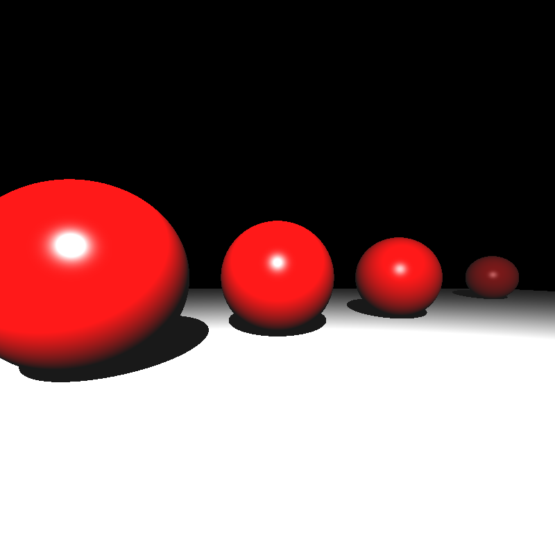

---

### 3) Ellipsoids
**Render Time:** 0.162s

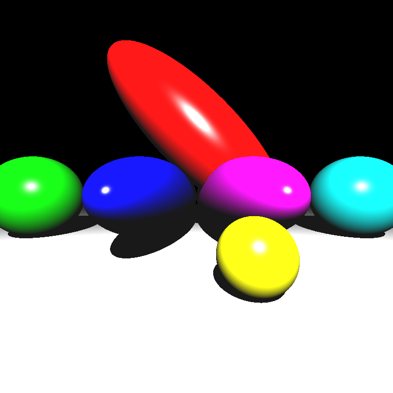

---

### 4) Marching Dragons
**Render Time:** 1.610s  

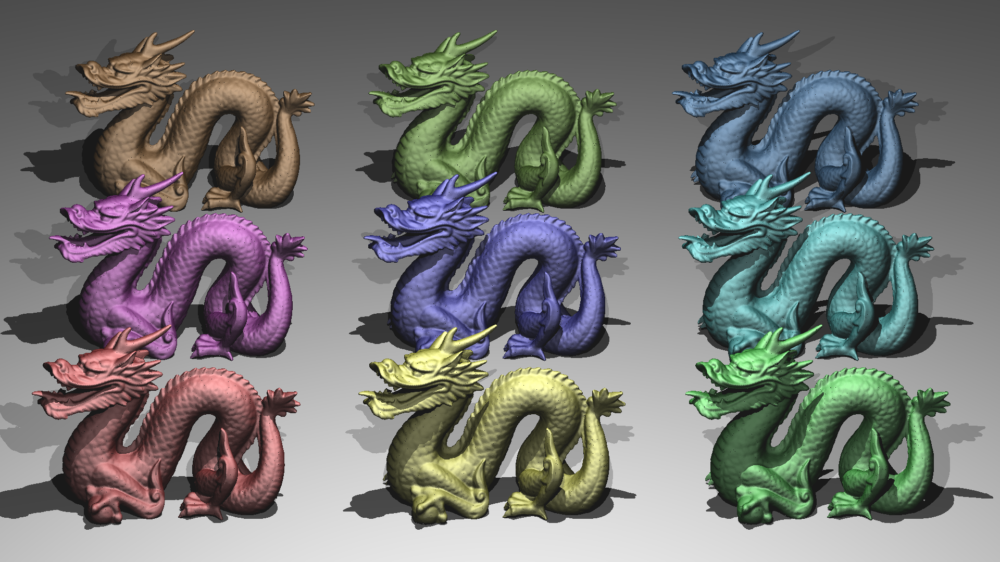

This scene demonstrates instancing perfectly - multiple copies of the same dragon mesh with different transformations. My BVH statistics for this scene was the following:
```
Top-level BVH: nodes=11 leaves=6 interior=5 maxDepth=4 
Mesh 0 BVH: nodes=1 leaves=1 interior=0 maxDepth=0 
Mesh 1 BVH: nodes=986789 leaves=493395 interior=493394 maxDepth=34 avgLeafPrim=1.76 maxLeafPrim=67
```

The dragon mesh has nearly 1 million BVH nodes, but it's built only once and shared across all instances.

---

### 5) Grass Desert
**Render Time:** 6.195s 

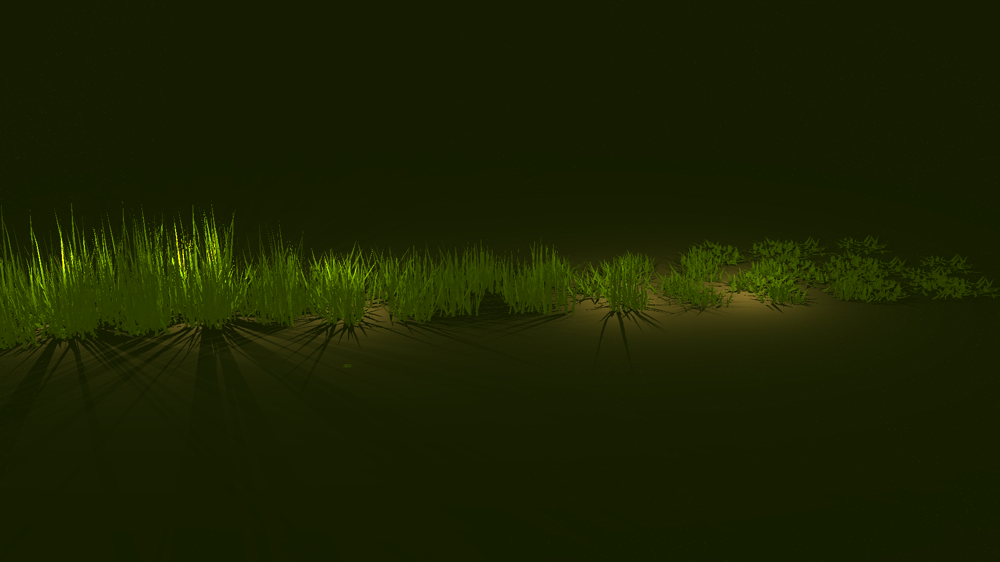

---

### 6) Dragon Metal
**Render Time:** 3.137s   
The circle isn't supposed to be there. If only it was a red circle. Then we would see the dragons more easily

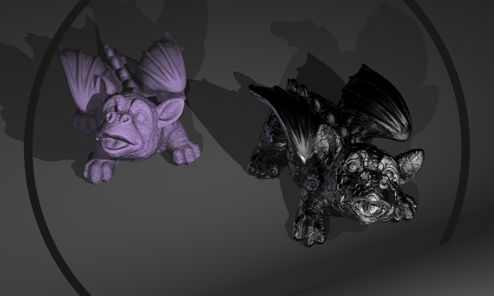

---

### 7) Two Berserkers
**Render Time:** 0.417s  
The original berserker image is rendered correctly. I couldn't find why this one wasn't. Hopefully I will by the next post. Also I believe some images below are wrong due to the same bug.


---

### 8) Metal Glass Plates
**Render Time:** 0.871s  

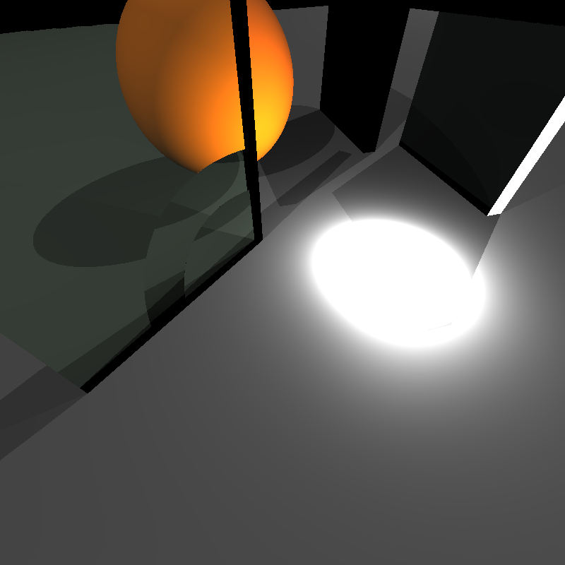

---

### 9) Mirror Room
**Render Time:** 0.286s  

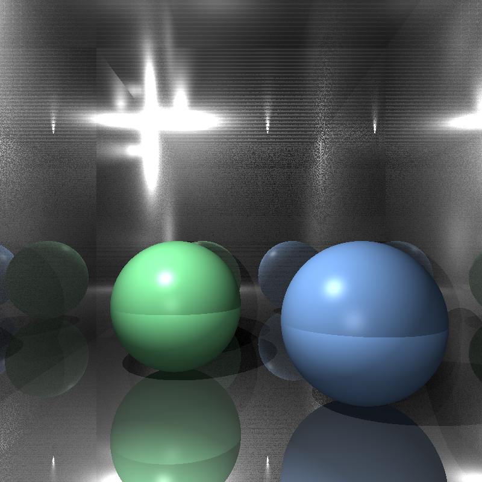

---

### 10) Dragon New (Front View)
**Render Time:** 13m 14.091s 

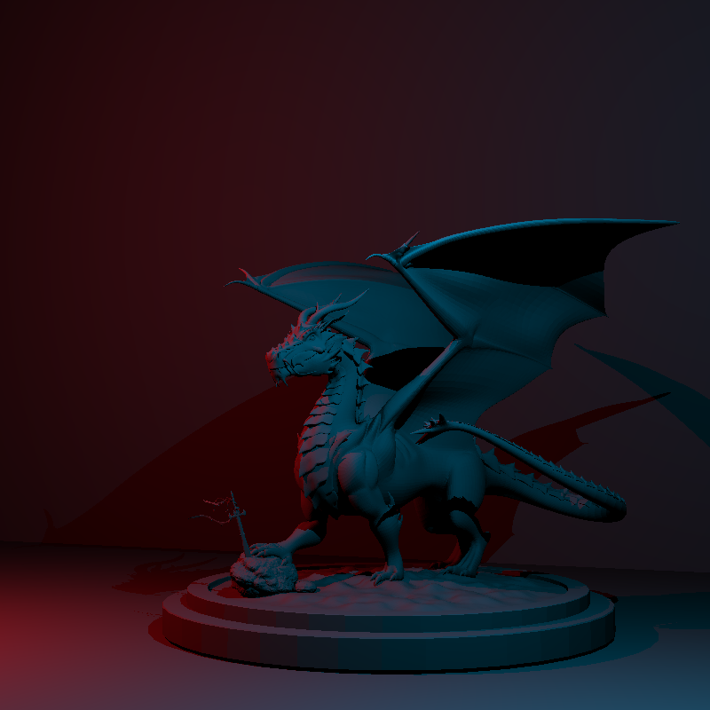

This scene takes much longer to render despite having BVH acceleration. The culprit? A poorly constructed BVH for one of the meshes:

```
Top-level BVH: nodes=3 leaves=2 interior=1 maxDepth=1 
Mesh 0 BVH: nodes=1 leaves=1 interior=0 maxDepth=0 
Mesh 1 BVH: nodes=1 leaves=1 interior=0 maxDepth=0 
Mesh 2 BVH: nodes=35257 leaves=17629 interior=17628 maxDepth=32 
            avgLeafPrim=23.48 maxLeafPrim=210888
```

Notice that `maxLeafPrim=210888` - there's a leaf node containing **210,888 triangles**! When a ray hits this leaf, it has to test all 210k+ triangles with no acceleration. This is a limitation of my median split approach - it doesn't handle degenerate geometry well. SAH would likely produce a much better tree here.

---

### 11) Dragon New (Top View)
**Render Time:** 12m 18.094s 

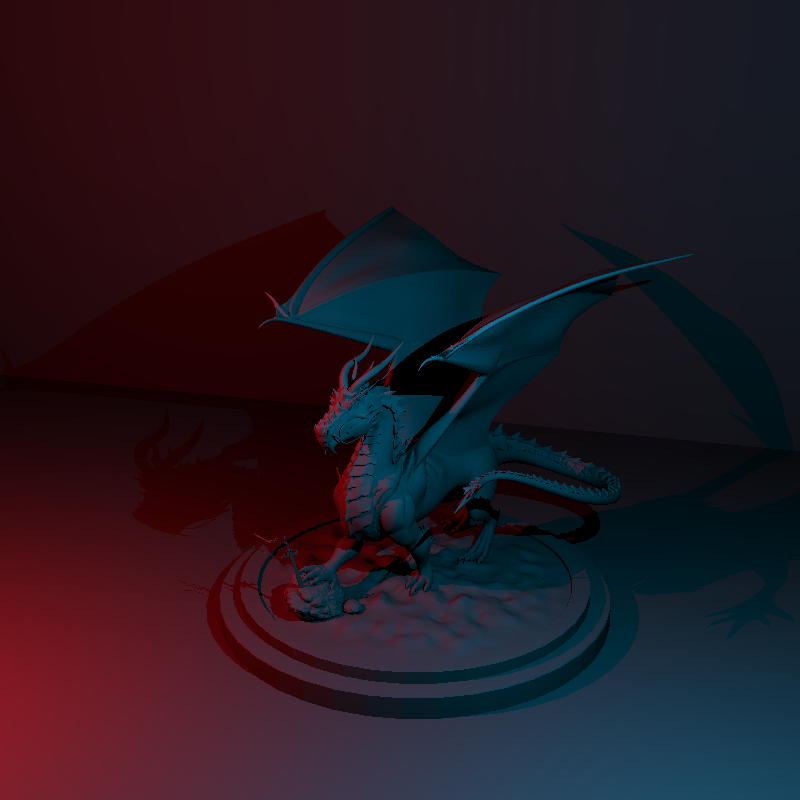

---

### 12) Dragon New (Right View)
**Render Time:** 13m 2.906s   

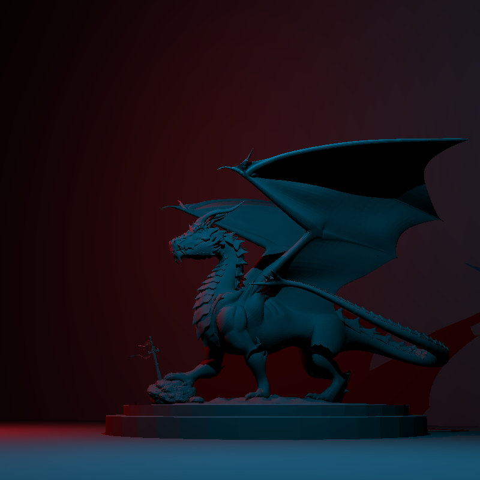

---

### 13) Glaring Davids
**Render Time:** 0.762s 

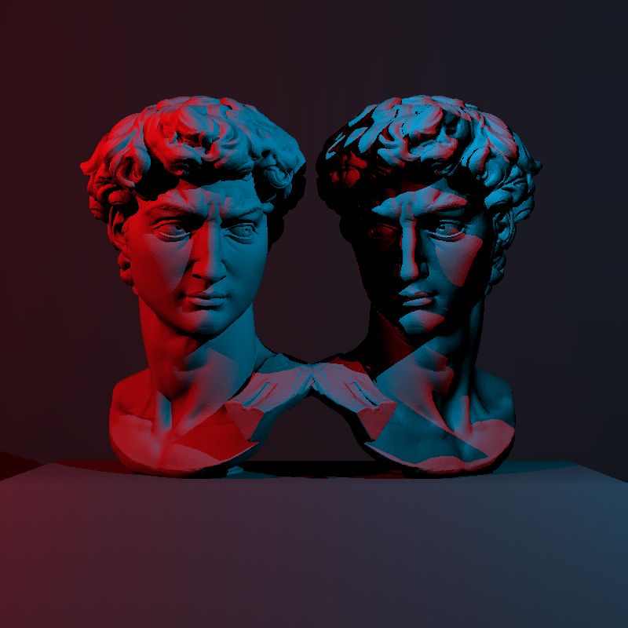

---

### 14) Davids Camera Zoom
**Render Time:** 1m 27.752s    
The camera is supposed to zoom in on the Davids. I couldn't find why it doesn't. I verified that different JSON files correctly result in different composite transform matrices for the camera.


---

### 15) Davids Camera Spin
**Render Time:** 1m 29.685s


---

### 16) Davids Lights Spin
**Render Time:** 1m 20.845s


---

## ✅ Closing & What's Next

This assignment transformed my ray tracer from a proof-of-concept into a genuinely usable tool. The BVH implementation alone provided speedups ranging from **8x to nearly 5000x** for complex scenes. What used to take hours now renders in seconds.

Beyond raw speed, adding transformations and instancing opened up entirely new possibilities for scene composition. I can now efficiently render forests, architectural scenes with repeated elements, and complex compositions that would have been impractical before.

The journey has been deeply rewarding. There's something satisfying about watching render times drop from 141 minutes to under 2 seconds while producing the exact same image. That's the power of good algorithms and data structures.

**Next up:** Multisampling and Distribution Ray Tracing. Time to add anti-aliasing, depth of field, glossy reflections, and soft shadows. The images will get prettier, and the ray tracer will get even more sophisticated.
