# 🌌 Making A Ray Tracer - Realism Through Randomness

> **Date:** 2025-12-06   
> **Stage:** 3 - Multisampling, Distribution Ray Tracing, Camera Effects

---
## 🚀 Introduction

*Welcome back, dear readers.*

Last homework was about speed - BVH acceleration made everything fast. This homework is about **realism**.

The problem? My images looked synthetic. Jagged edges everywhere. Everything in perfect focus. Hard shadows. Mirror-smooth reflections. Objects frozen in time.

Real cameras blur things. Real materials are rough. Real lights have area. Real motion takes time.

The solution? **Randomness**. Send multiple rays per pixel, each slightly different. Average the results. From chaos comes clarity.

This is **distribution ray tracing** - using stochastic sampling across multiple dimensions (pixel position, time, aperture, light position, reflection direction) to simulate effects that would be impossible with single rays.

Let's see how random numbers make realistic images.


## 🎯 Goals for This Stage

- **Multisampling**: Anti-aliasing through stratified sampling
- **Motion Blur**: Random time parameters for moving objects
- **Depth of Field**: Aperture sampling for camera focus effects
- **Area Lights**: Spatial sampling for soft shadows
- **Glossy Reflections**: Perturbed reflections for rough surfaces
- **Bug Fixes**: Resolve issues from previous homeworks

## 📐 Multisampling: The Foundation

### The Problem

When you send a single ray through the center of each pixel, you get **aliasing** - those ugly jagged edges on diagonal lines and curves. One ray can't possibly represent everything happening in a pixel.

The solution? **Send multiple rays per pixel** and average the results.

### Jittered Sampling

The naive approach is uniform sampling - divide the pixel into a grid and sample each cell center. But this creates patterns and artifacts.

Better approach: **jittered (stratified) sampling**. Divide the pixel into a grid, but add a random offset within each cell. This decorrelates the samples while maintaining good coverage.

### Implementation Changes

**Main Loop Comparison:**

Before (Single Sample):
```cpp
#pragma omp parallel for collapse(2) schedule(static)
for (int i = 0; i < height; ++i) {
    for (int j = 0; j < width; ++j) {
        Ray ray = ComputeRay(scene, camera, j, i);
        Vec3f color = ComputeColor(ray, scene, camera);

        const size_t idx = (static_cast<size_t>(i) * width + j) * 3;
        image[idx + 0] = (unsigned char)clampF(color.x, 0.0f, 255.0f);
        image[idx + 1] = (unsigned char)clampF(color.y, 0.0f, 255.0f);
        image[idx + 2] = (unsigned char)clampF(color.z, 0.0f, 255.0f);
    }
}
```

After (Multisampling with Stratified Jittering):
```cpp
#pragma omp parallel for collapse(2) schedule(static)
for (int i = 0; i < height; i++) {
    for (int j = 0; j < width; j++) {
        // Unique RNG seed per pixel
        std::mt19937 rng(i * width + j);
        std::uniform_real_distribution<float> dist(0.0f, 1.0f);
        
        Vec3f color_sum(0.0f, 0.0f, 0.0f);
        
        // Stratified sampling loop
        for (int s = 0; s < num_samples; ++s) {
            int sx = s % samples_per_side;
            int sy = s / samples_per_side;
            
            // Jitter within stratified cell
            float jitter_x = (sx + dist(rng)) / samples_per_side;
            float jitter_y = (sy + dist(rng)) / samples_per_side;
            
            Ray ray = ComputeRay(scene, camera, j, i, jitter_x, jitter_y);
            Vec3f sample_color = ComputeColor(ray, scene, camera);
            
            color_sum = color_sum + sample_color;
        }
        
        Vec3f color = color_sum * inv_num_samples;
        
        const size_t idx = (static_cast<size_t>(i) * width + j) * 3;
        image[idx + 0] = (unsigned char)clampF(color.x, 0.0f, 255.0f);
        image[idx + 1] = (unsigned char)clampF(color.y, 0.0f, 255.0f);
        image[idx + 2] = (unsigned char)clampF(color.z, 0.0f, 255.0f);
    }
}
```

**ComputeRay Comparison:**

The change here is minimal but crucial:

Before:
```cpp
float su = (j + 0.5f) * camera.pixel_width;  // Always pixel center
float sv = (i + 0.5f) * camera.pixel_height;
```

After:
```cpp
float su = (j + jitter_x) * camera.pixel_width;  // Stratified random position
float sv = (i + jitter_y) * camera.pixel_height;
```

**Key improvements:**
- Per-pixel RNG seeding (`i * width + j`) for reproducible randomness
- Stratified grid (e.g., 4×4 for 16 samples) instead of uniform random
- Jitter within each cell to avoid patterns
- Average all samples for final pixel color

This forms the foundation for all distribution ray tracing effects. Every effect will use these multiple samples differently.

## 🏃 Motion Blur: Freezing Motion

Real cameras have **exposure time** - the shutter stays open for a duration, capturing everything that happens during that interval. Fast-moving objects appear blurred because they occupy multiple positions during exposure.

In ray tracing, we simulate this by adding a **time dimension** to each ray.

### The Concept

Each ray gets a random time parameter `t ∈ [0, 1)`:
- `t = 0`: Object at start of exposure (base position)
- `t = 1`: Object at end of exposure (base position + motion vector)
- `t ∈ (0, 1)`: Linear interpolation between the two

Objects define a `MotionBlur` vector representing their displacement during the exposure. When a ray with time `t` intersects the object, we offset the object's position by `t × motionBlur`.

**Critical rule:** Time is only randomized for **primary rays**. All secondary rays (reflections, refractions, shadows) inherit their parent ray's time. This ensures temporal consistency - if you see a moving object's reflection at time t=0.5, the reflection ray should also see the world at t=0.5.

### Implementation

**Ray Structure:**
```cpp
struct Ray {
    Vec3f origin;
    Vec3f direction;
    int depth;
    float time;  // New: [0, 1) for motion blur
};
```

**Generating Random Time in Main Loop:**
```cpp
for (int s = 0; s < num_samples; ++s) {
    // ... jitter calculations ...
    
    float time = dist(rng);  // Random time [0, 1)
    
    Ray ray = ComputeRay(scene, camera, j, i, jitter_x, jitter_y, time);
    Vec3f sample_color = ComputeColor(ray, scene, camera);
    // ...
}
```

**Applying Motion Blur in Intersection:**

When checking if a ray hits a transformed object with motion blur, we adjust the ray position in world space **before** transforming to object space:
```cpp
// Before transformation
if (mesh.has_motion_blur) {
    // Move ray backward by motion amount
    // (equivalent to moving object forward)
    rayOrigin = ray.origin - mesh.motion_blur * ray.time;
}

// Transform adjusted ray to object space
Ray local_ray;
local_ray.origin = mesh.invTransformation.transformPoint(rayOrigin);
local_ray.direction = mesh.invTransformation.transformVector(ray.direction).normalize();
local_ray.time = ray.time;  // Preserve time for secondary rays

// Do intersection test...

// Transform result back to world space
if (mesh.has_motion_blur) {
    worldHit = worldHit + mesh.motion_blur * ray.time;  // Add motion back
}
```

**Why subtract then add?** We transform the ray to where the object *was* at t=0, do the intersection, then transform the hit point to where the object *actually is* at time t.

### Results

| 1 Sample (No Motion) | 1 Sample (Motion Blur) | 100 Samples (Motion Blur) |
|----------------------|------------------------|---------------------------|
| 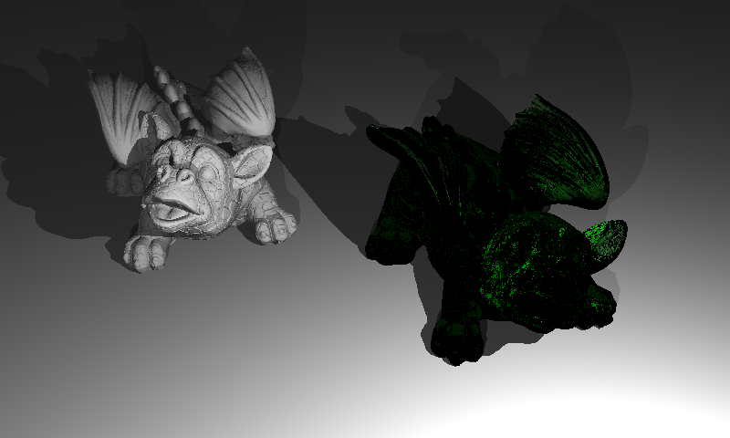 | 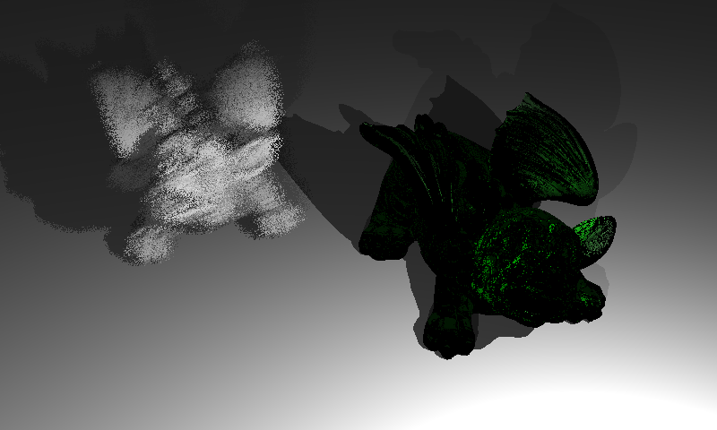 |  |
| Both dragons sharp and clear | White dragon noisy at random position | White dragon smoothly blurred across motion path |

The white dragon has motion blur enabled, the green one doesn't. Notice how with just 1 sample, the moving dragon appears noisy and uncertain - it's captured at a single random moment in time. With 100 samples, we get smooth, cinematic motion blur as the dragon sweeps across its path.

The green dragon also benefits from increased samples - its edges become smoother due to antialiasing, even though it has no motion blur. This is multisampling at work: more samples improve image quality across the board, whether through motion blur, antialiasing, or (as we'll see next) depth of field.

Note: The green dragon looks darker because my dielectrics are broken. I couldn't fix them yet.


## 📷 Depth of Field: Through the Looking Glass

Pinhole cameras have infinite depth of field - everything from near to far is perfectly sharp. Real cameras have **finite apertures** and **lenses**, which means only objects at a specific distance (the **focal distance**) appear sharp. Everything else blurs.

This is depth of field (DOF), and it's one of the most recognizable characteristics of real photography.

### The Concept

A pinhole camera shoots rays from a single point (the camera origin). A real camera shoots rays from **many points across the aperture** (lens surface), all converging on the focal plane.

- Objects **at the focal distance**: All rays from different aperture points converge to the same point → sharp
- Objects **closer or farther**: Rays from different aperture points hit different spots → blurred

The larger the aperture, the more pronounced the blur. Photographers call this "bokeh."

### Implementation

**Camera Parameters:**
```cpp
struct Camera {
    // ... existing fields ...
    float aperture_size;      // Edge length of square lens
    float focus_distance;     // Distance to focal plane
    bool has_depth_of_field;  // Enable/disable DOF
};
```

**Main Loop Changes:**

We need to sample **two** random positions now: one in the pixel, one on the aperture. To avoid correlation, we shuffle the aperture samples:
```cpp
for (int s = 0; s < num_samples; ++s) {
    // Pixel jitter (stratified)
    int sx = s % samples_per_side;
    int sy = s / samples_per_side;
    float jitter_x = (sx + dist(rng)) / samples_per_side;
    float jitter_y = (sy + dist(rng)) / samples_per_side;
    
    // Aperture jitter (shuffled, stratified)
    int aperture_idx = shuffle_array[s];  // Shuffled to decorrelate
    int ax = aperture_idx % samples_per_side;
    int ay = aperture_idx / samples_per_side;
    float aperture_u = (ax + dist(rng)) / samples_per_side;
    float aperture_v = (ay + dist(rng)) / samples_per_side;
    
    float time = dist(rng);
    
    Ray ray = ComputeRay(scene, camera, j, i, 
                        jitter_x, jitter_y, 
                        aperture_u, aperture_v, 
                        time);
    // ...
}
```

**ComputeRay with DOF:**

The algorithm:
1. Compute pixel sample position `q` on image plane
2. Shoot ray from camera center through `q` to find focal plane intersection `p`
3. Sample random point `s` on aperture
4. Shoot ray from `s` toward `p`
```cpp
Ray ComputeRay(..., float aperture_u, float aperture_v, float time)
{
    // Sample position on image plane
    float su = (j + jitter_x) * camera.pixel_width;  
    float sv = (i + jitter_y) * camera.pixel_height;  
    Vec3f pixel_sample_point = camera.q + su * camera.u - sv * camera.v;
    
    Ray ray;
    ray.depth = 0;
    ray.time = time;
    
    if (!camera.has_depth_of_field) {
        // Pinhole camera (no DOF)
        ray.origin = camera.position;
        ray.direction = (pixel_sample_point - camera.position).normalize();
    } else {
        // Depth of field camera
        Vec3f o = camera.position;
        
        // 1. Direction through pixel
        Vec3f dir = (o - pixel_sample_point).normalize();
        
        // 2. Find focal plane intersection
        float t_focal = camera.focus_distance / dir.dot(-camera.w);
        Vec3f focal_point = o + dir * t_focal;
        
        // 3. Sample point on aperture (square lens)
        float lens_u = (aperture_u - 0.5f) * camera.aperture_size;
        float lens_v = (aperture_v - 0.5f) * camera.aperture_size;
        Vec3f lens_sample = o + lens_u * camera.u + lens_v * camera.v;
        
        // 4. Ray from lens sample to focal point
        ray.origin = lens_sample;
        ray.direction = (focal_point - lens_sample).normalize();
    }
    
    return ray;
}
```

**Key insight:** The focal plane is where all rays converge. Objects there stay sharp regardless of which aperture point we sample from.

### Results

Depth of field transforms how we perceive a scene. Without DOF, everything is equally sharp regardless of distance. With DOF, only objects at the focal distance stay sharp - everything else blurs based on how far they are from that plane.

| No DOF (Pinhole) | With DOF (Aperture Camera) |
|------------------|----------------------------|
| 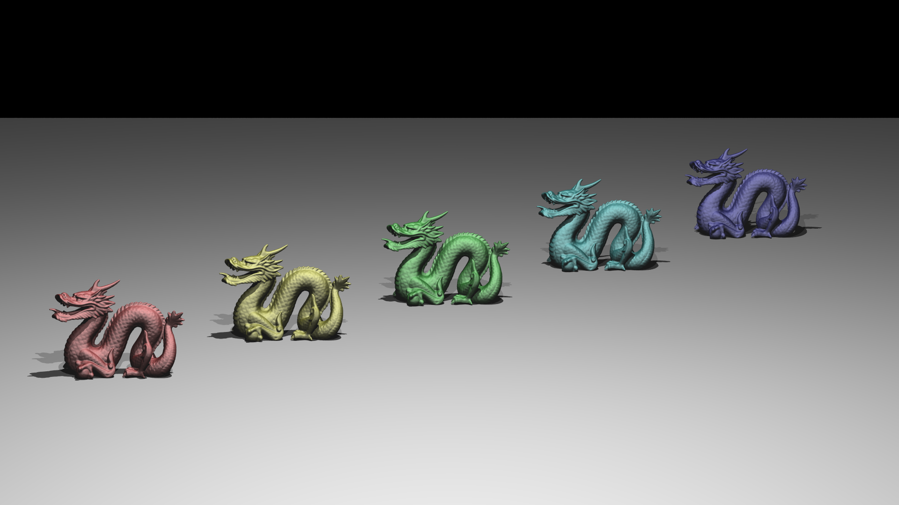 | 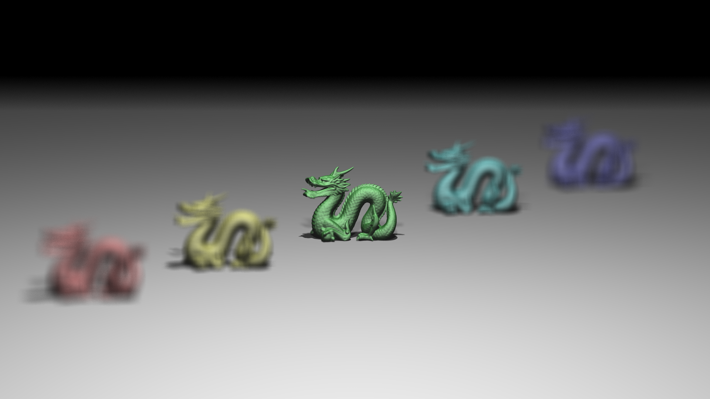 |
| All dragons equally sharp from near to far | Center dragon sharp (at focal distance), others blur with distance |

In the DOF image, the camera focuses on the green dragon in the center. The closer dragons (red and yellow) and farther dragons (cyan and purple) both blur out, with the amount of blur increasing with distance from the focal plane. This is exactly how real camera lenses work - creating that cinematic "bokeh" effect that draws attention to your subject.

The larger the aperture size, the stronger the effect. This is why photographers talk about "shallow depth of field" for portraits (large aperture, small f-number) versus "deep depth of field" for landscapes (small aperture, large f-number).

## 💡 Area Lights: Soft Shadows

Point lights are physically impossible - they're dimensionless sources emitting light from a single point. This creates **hard shadows** with razor-sharp edges. Flip a switch in the real world and you'll never see such shadows.

Real light sources have area. Lightbulbs, windows, the sun - they all occupy space. This creates **soft shadows** with gradual transitions from light to dark.

### The Concept

An area light is a square emitter with:
- **Position**: Center point
- **Normal**: Surface orientation  
- **Size**: Edge length (area = size²)
- **Radiance**: Emitted light per unit area per unit solid angle

For each surface point being shaded, we sample a random point on each area light. Different samples hit different points on the light, and averaging them creates the soft shadow effect.

**Why soft?** Consider a point in partial shadow. Some samples can "see" part of the light (not in shadow), others can't (blocked). Averaging these binary decisions creates the gradual penumbra.

### Implementation

**Area Light Structure:**
```cpp
struct AreaLight {
    Vec3f position;      // Center of square
    Vec3f normal;        // Surface normal
    float size;          // Edge length
    Vec3f radiance;      // Emitted radiance (RGB)
};
```

**Shading with Area Lights:**

For each intersection point, for each area light:
```cpp
for (const auto& area_light : scene.area_lights)
{
    // Sample random point on area light square
    float u = (dist(rng) - 0.5f) * area_light.size;  // [-size/2, size/2]
    float v = (dist(rng) - 0.5f) * area_light.size;
    
    // Create orthonormal basis for area light
    Vec3f n_light = area_light.normal;
    Vec3f tangent, bitangent;
    CreateOrthonormalBasis(n_light, tangent, bitangent);
    
    Vec3f light_sample_point = area_light.position + tangent * u + bitangent * v;
    Vec3f to_light = light_sample_point - x;
    float dist_to_light = to_light.length();
    Vec3f wi = to_light / dist_to_light;  // Normalized direction to light
    
    // Check visibility with shadow ray
    Ray shadow_ray;
    shadow_ray.origin = x + n_shading * eps_shift;
    shadow_ray.direction = wi;
    shadow_ray.depth = 0;
    shadow_ray.time = ray.time;
    
    // Check if shadow ray hits anything before reaching the light
    HitRecord shadow_hit;
    bool in_shadow = false;
    if (FindClosestHit(shadow_ray, scene, camera, shadow_hit)) {
        float dist_to_hit = (shadow_hit.intersectionPoint - shadow_ray.origin).length();
        if (dist_to_hit < dist_to_light - eps_shift) {
            in_shadow = true;
        }
    }
    
    if (!in_shadow) {
        // Compute solid angle (from PDF: dw = A * (n_l · w_i) / d^2)
        float cos_light = std::abs(area_light.normal.dotProduct(wi * -1.0f));
        float area = area_light.size * area_light.size;
        float solid_angle = (area * cos_light) / (dist_to_light * dist_to_light);
        
        // Irradiance = Radiance x solid_angle
        Vec3f irradiance = area_light.radiance * solid_angle;
        
        // Diffuse component
        float cos_theta = std::max(0.0f, n_shading.dotProduct(wi));
        Vec3f diffuse = mat.diffuse_refl.elwiseMult(irradiance) * cos_theta;
        
        // Specular component (Blinn-Phong)
        Vec3f h = (wi + w0).normalize();
        float cos_alpha = std::max(0.0f, n_shading.dotProduct(h)); 
        float spec_factor = std::pow(cos_alpha, mat.phong_exponent);
        Vec3f specular = mat.specular_refl.elwiseMult(irradiance) * spec_factor;
        
        color = color + diffuse + specular;
    }
}
```

**Two-sided emission:** We use `abs(normal.dot(-wi))` to make lights emit from both sides. This is more flexible for scene composition.

**Note:** I didn’t pre-generate the random samples for my area lights; instead, I computed them on the fly. Pre-generating and stratifying these samples would produce less noisy results.


### Results

| No Stratification (Mine) | With Stratification |
|------------------|----------------------------|
| 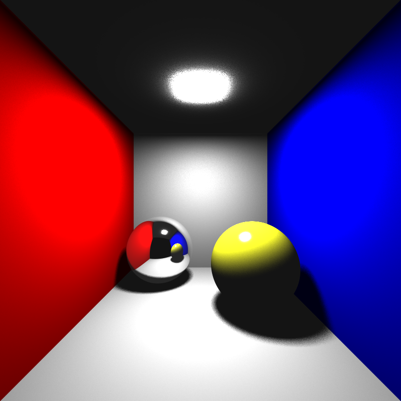 |  |

## ✨ Glossy Reflections: Imperfect Mirrors

Perfect mirrors don't exist in nature. Real metallic surfaces - brushed aluminum, steel, even polished metal - have microscopic imperfections that scatter reflected light slightly.

This is **roughness**, and it's what separates a chrome ball from brushed metal.

### The Concept

Instead of reflecting rays in the perfect mirror direction, we perturb the reflection direction slightly based on a **roughness parameter**:

For each sample, we add a random offset to the perfect reflection direction. More roughness = larger random offset. Averaging many samples creates the blurred reflection effect.

### Implementation

**Material Roughness:**
```cpp
struct Material {
    // ... existing fields ...
    float roughness;  // 0 = perfect, higher = rougher
};
```

**Perturbing the Reflection:**
```cpp
Vec3f PerturbReflection(const Vec3f& perfect_reflection, float roughness,
                        std::mt19937& rng, 
                        std::uniform_real_distribution<float>& dist)
{
    if (roughness <= 0.0f) {
        return perfect_reflection;  // No perturbation
    }
    
    // Create orthonormal basis around perfect reflection
    Vec3f r = perfect_reflection;
    Vec3f u, v;
    CreateOrthonormalBasis(r, u, v);
    
    // Generate random offsets centered at 0
    float xi1 = dist(rng);  // [0, 1)
    float xi2 = dist(rng);
    
    // Perturb: r' = normalize(r + roughness * ((ξ₁ - 0.5)*u + (ξ₂ - 0.5)*v))
    Vec3f r_perturbed = r + u * (roughness * (xi1 - 0.5f)) 
                          + v * (roughness * (xi2 - 0.5f));
    
    return r_perturbed.normalize();
}
```

**Applying to Materials:**

In shading code, whenever we compute a reflection (or refraction) ray:
```cpp
// Compute perfect reflection
Vec3f wr_perfect = (normal * 2.0f * normal.dot(wo) - wo).normalize();

// Apply roughness perturbation
Vec3f wr = PerturbReflection(wr_perfect, material.roughness, rng, dist);

// Trace reflection ray with perturbed direction
Ray reflection_ray;
reflection_ray.origin = intersection_point + normal * epsilon;
reflection_ray.direction = wr;
reflection_ray.depth = ray.depth + 1;
reflection_ray.time = ray.time;  // Inherit time

Vec3f reflection_color = ComputeColor(reflection_ray, scene, camera);
```

**Why it works:** Each sample perturbs the reflection slightly differently. Averaging them blurs the reflection, simulating light scattering from a rough surface.

### Results

| Before Glossy Reflections | After Glossy Reflections |
|------------------|----------------------------|
| 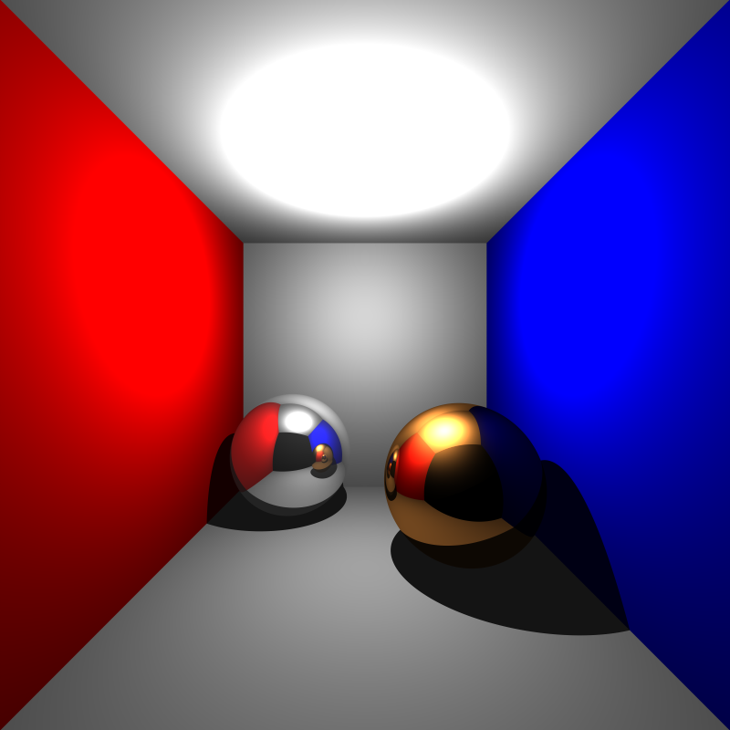 |  |

## 🔧 Bug Fixes from Previous Homeworks
While implementing these features, I also fixed a few lingering bugs from HW2 that were causing incorrect renders in certain scenes.

### Bug 1: Shadow Ray Transform Issue

**Problem:** In scenes with transformed meshes (berserker.json), shadows were appearing incorrectly. The issue was that when transforming a ray to object space, I was transforming the ray's origin and direction but **not** the `minT` parameter used for shadow ray intersection tests.

**Root cause:** When a transformation includes scaling, the length of the transformed direction vector changes. A distance of `d` in world space becomes `d * scale` in object space. Shadow rays need to check if there's an occluder within a specific distance, so `minT` must be scaled accordingly.

**Fix:**
```cpp
if (mesh.hasTransform) {
    // Transform ray to object space
    testRay.origin = mesh.invTransformation.transformPoint(ray.origin);
    testRay.direction = mesh.invTransformation.transformVector(ray.direction).normalize();
    
    // Transform minT to object space as well
    Vec3f worldDir = ray.direction;
    Vec3f objDir = mesh.invTransformation.transformVector(worldDir);
    float scale = objDir.length();  // Scale factor from transform
    testMinT = minT * scale;
}
```
| Before (Broken Shadows) | After (Fixed partly) |
|-------------------------|---------------|
| .png) | 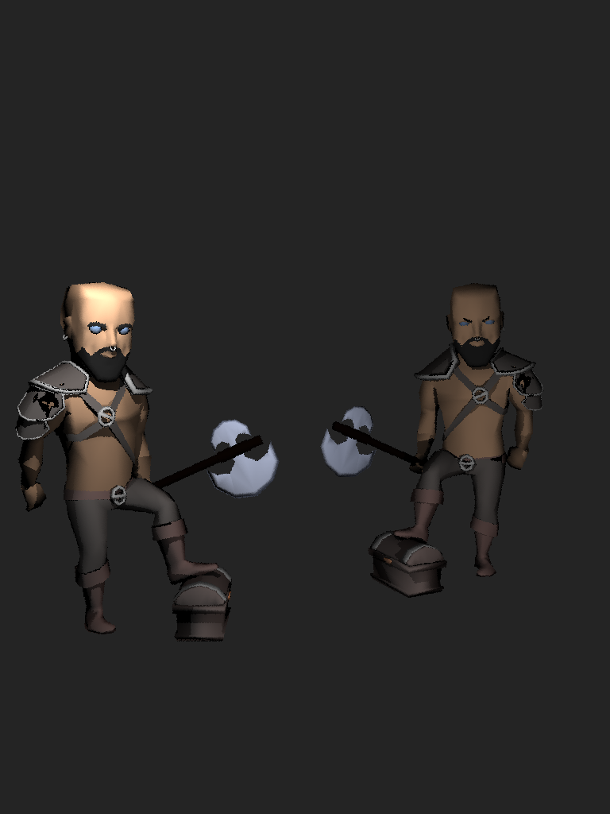 |

**Note on two_berserkers.json:** You can still see some cracks/artifacts in their armor. Still investigating.

### Bug 2: Missing Reference Parameter

**Problem:** Multiple scenes (dragon_dynamic.json, plates.json, david.json) were rendering incorrectly - missing reflections, wrong materials applied, circular artifacts.

**Root cause:** The `closestMeshId` parameter in `IntersectTopBVH` was passed by value instead of by reference. When the function found the closest mesh and updated `closestMeshId`, the change wasn't propagating back to the caller. This meant the shading code didn't know which mesh was actually hit. Which caused some undefined behaviour.

**Fix:**
```cpp
void IntersectTopBVH(const Ray& ray, const Scene& scene, float& minT, bool& has_intersected,
                     PrimKind& closestType, int& closestMatId, int& index,
                     Face& hitTriFace, Sphere& closestSphere, Triangle& closestTriangle,
                     int& closestMeshId,  // Added & here!
                     float& bary_beta, float& bary_gamma) noexcept
```

One missing `&` symbol, three broken scenes:

| Scene | Before (Broken) | After (Fixed) |
|-------|-----------------|---------------|
| dragon_metal | .png) | 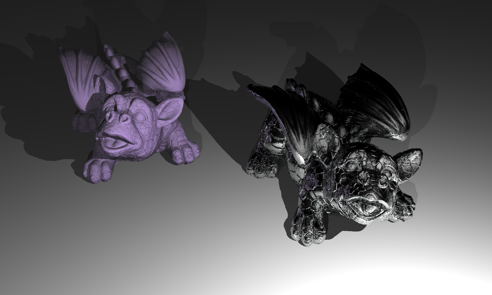 |
| metal_glass_plates | .png) | 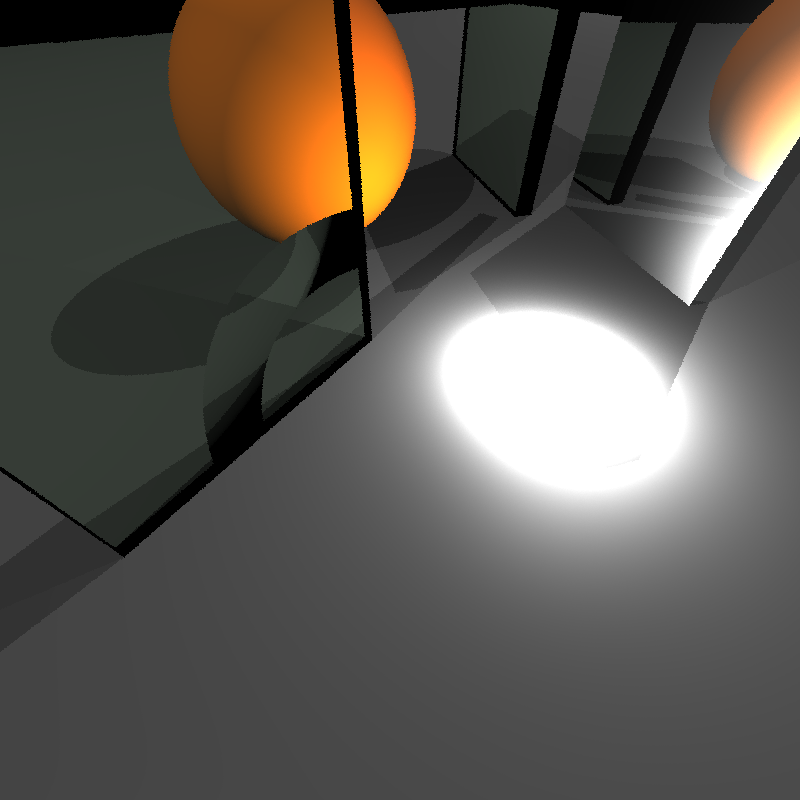 |
| glaring_davids | .png) | 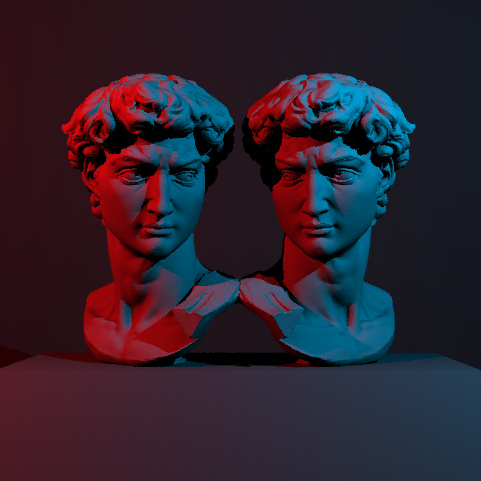 |

Sometimes the smallest bugs cause the biggest headaches. 🐛

**Note on metal_glass_plates.json:** The left plate still has a circular artifact. This plate is dielectric (glass), and as mentioned earlier, my dielectric implementation has some issues. This will be addressed in future work.

---

## ⏱️ Render Times & Output Gallery

### 1) Cornell Box Area_Light
**Render Time:** 4.431s


---

### 2) Cornell Box Dynamic
**Render Time:** 24.041s

I couldn't figure out whats the problem with this scene.

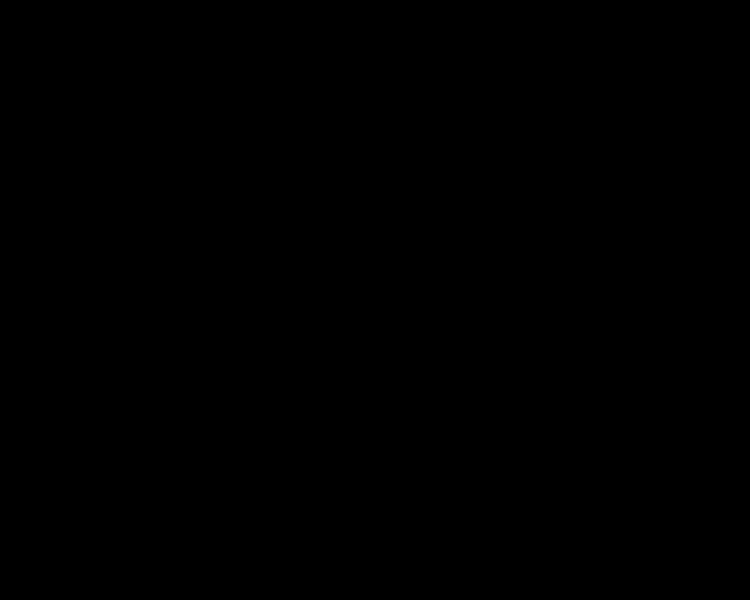

---

### 3) Cornell Box Brushed Metal
**Render Time:** 16.985s

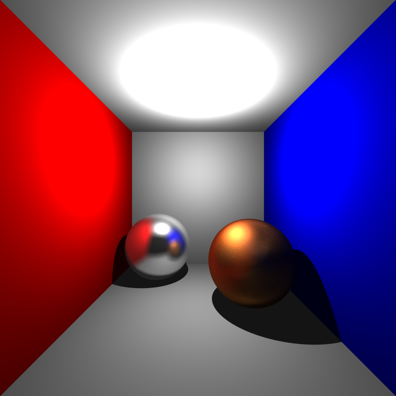

---

### 4) Dragon Dynamic
**Render Time:** 3m 1.374s

Broken dielectric #1. Darker dragon.

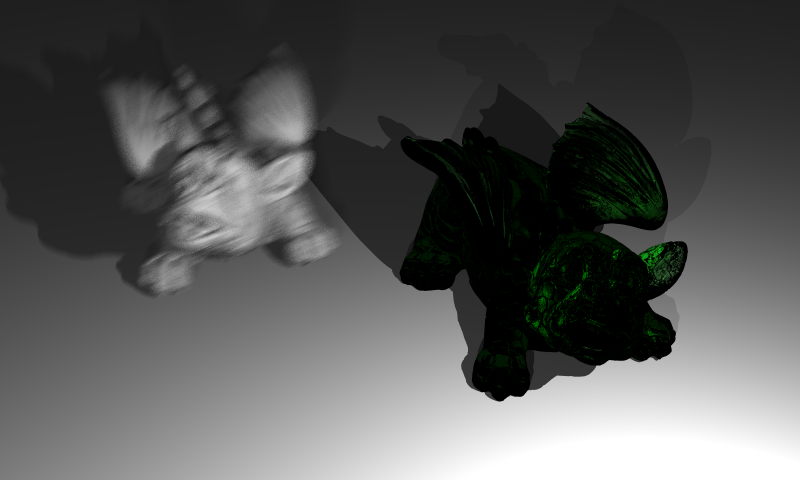

---

### 5) Focusing Dragons
**Render Time:** 24.214s


---

### 6) Spheres DOF
**Render Time:** 3.436s

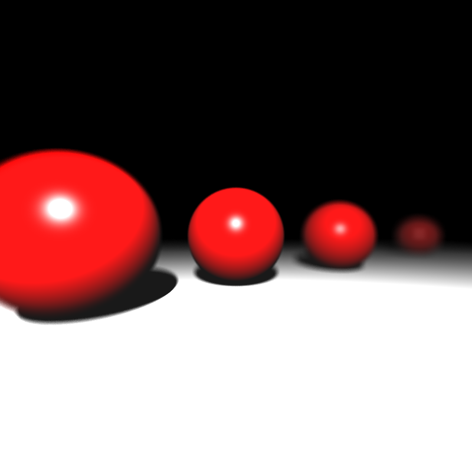

---

### 7) Metal Glass Plates
**Render Time:** 22.865s

Broken dielectric #2. Random circle still there

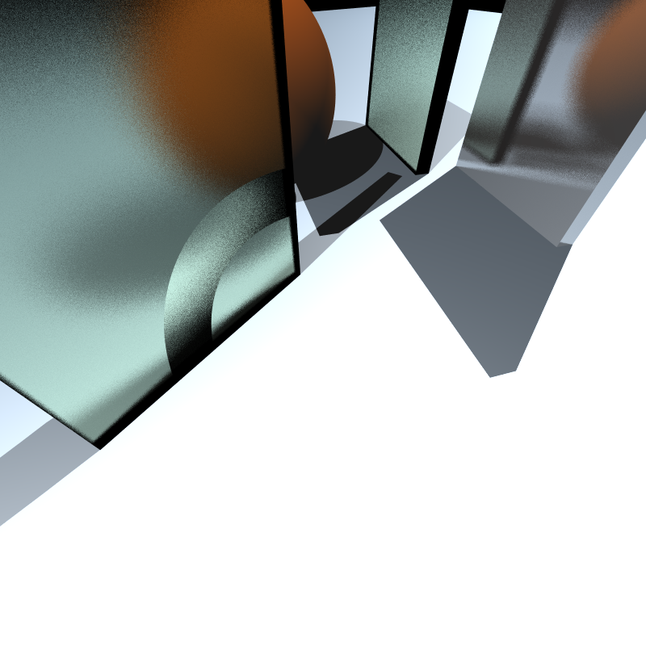

---

### 8) Chessboard Area_Light
**Render Time:** 17.712s


---

### 9) Chessboard Area_Light + DOF
**Render Time:** 19.546s

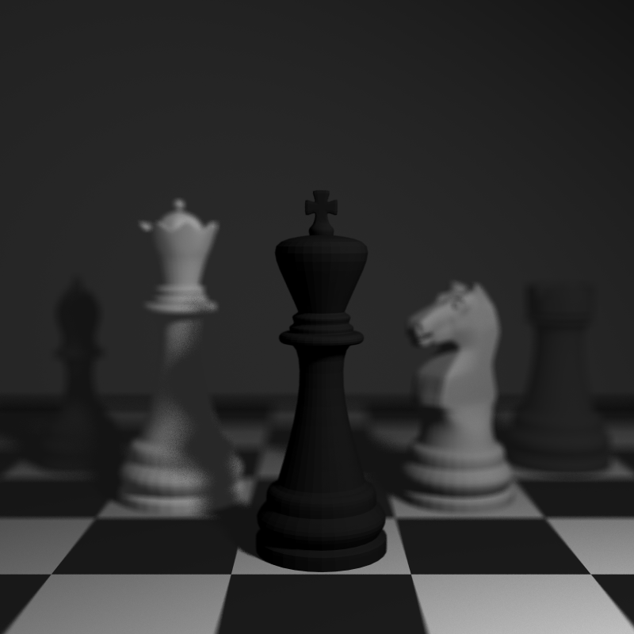

---

### 10) Chessboard Area_Light + DOF + Dielectric
**Render Time:** 44.362s

Broken dielectric #3. Darker queen.

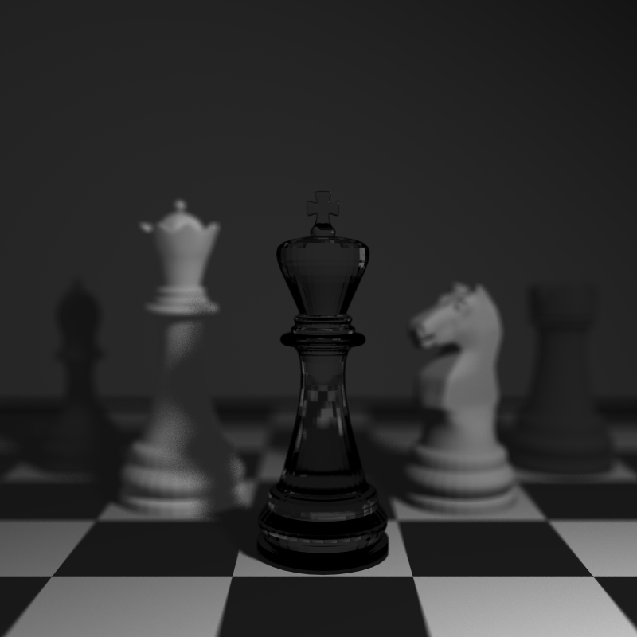

---

### 11) Deadmau5
**Render Time:** 42.299s

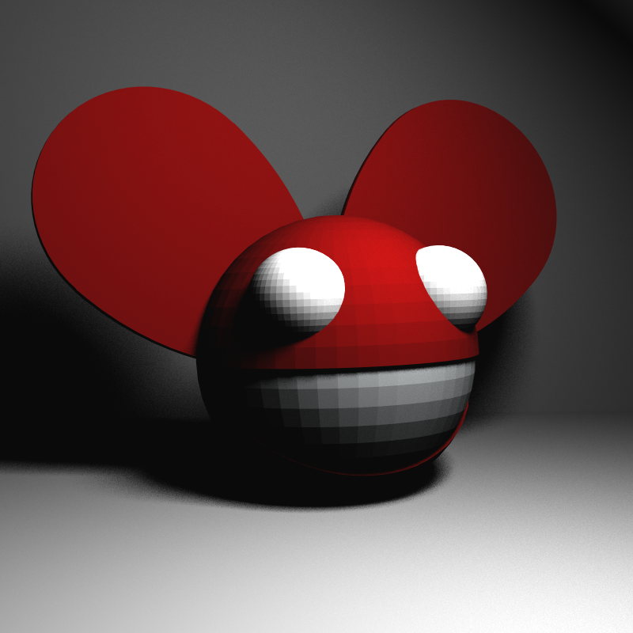

---

### 12) Wine Glass
**Render Time:** 9m 41.730s

Broken dielectric #4. Darker glass.

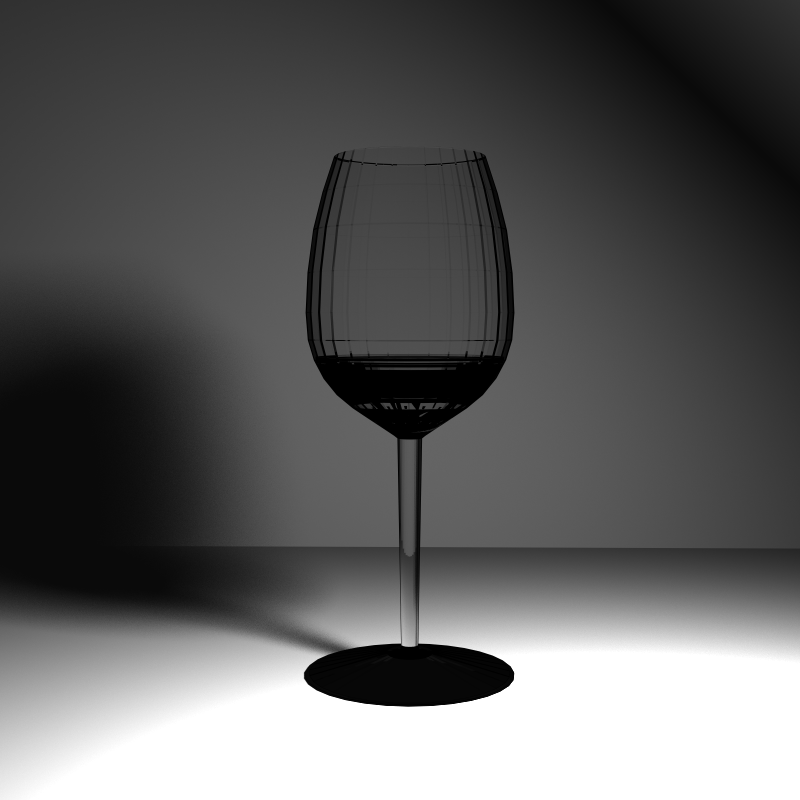

---

### 12) Tap Water
**Render Time:** 71m 54.995s

Broken dielectric #5. Darker water.

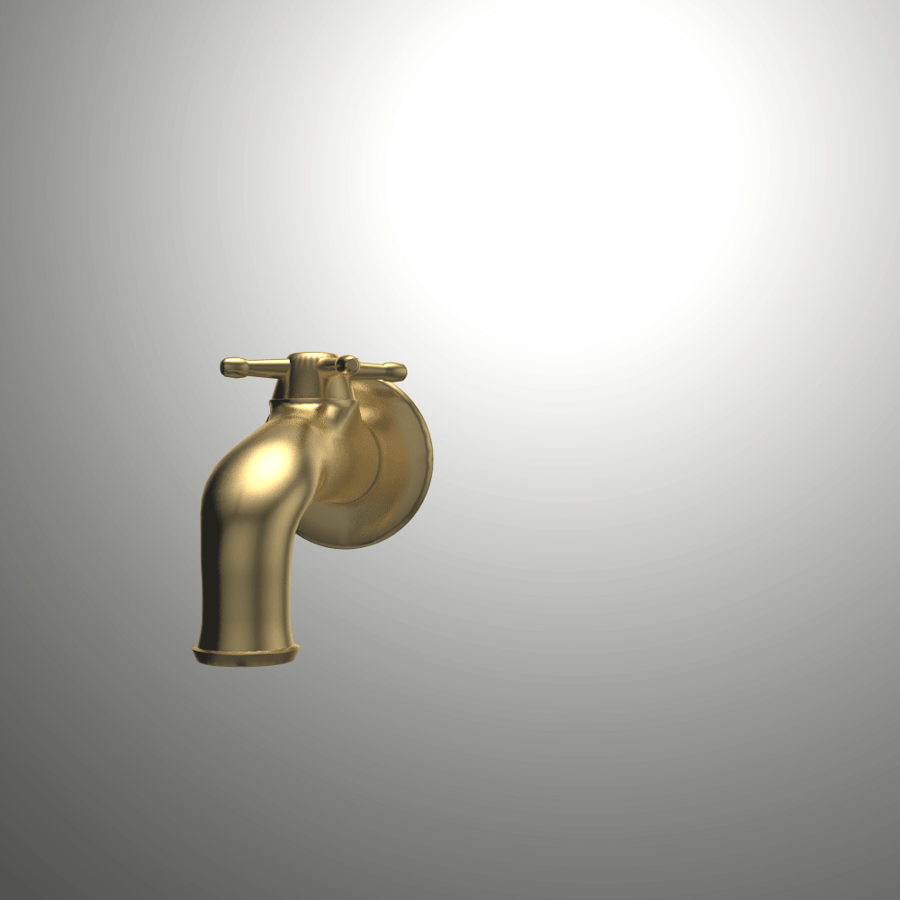

---

## ✅ Conclusion

This homework taught me a counterintuitive lesson: **randomness creates realism**. Multiple rays with random jitter smooth edges. Random times blur motion. Random aperture positions create depth of field. Random light samples soften shadows. Random reflection/refraction directions roughen materials.

The implementation was straightforward - add random number generation, send multiple samples, average the results. But the results? Transformative. My ray tracer went from producing clean but synthetic images to creating scenes that actually look *real*. There's still work to do (dielectrics render darker than expected), but the core goal is achieved: **Realism through randomness**. 🎲✨

Next up: texture mapping. Time to add actual detail to surfaces instead of just solid colors.
